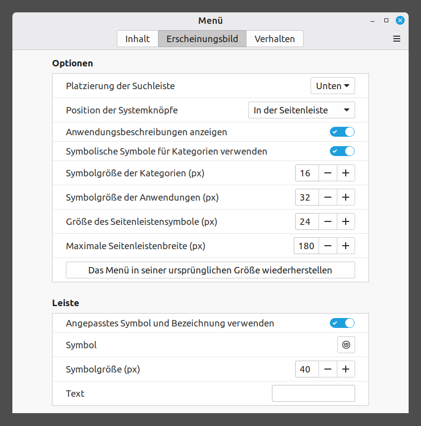
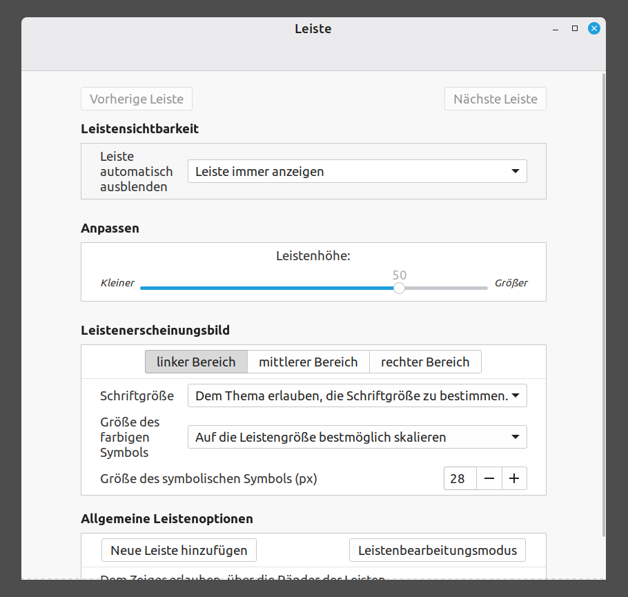
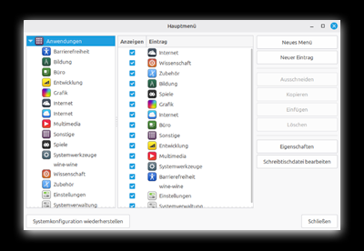

# Erste Schritte mit Linux

Handbuch Für Einsteiger

> WEGWERFEN? DENKSTE! REPAIRCAFE.ORG

Adaptiert von: https://www.repaircafe.org/de/repair-cafe-linux/

[![CC BY-NC-SA 4.0][cc-by-nc-sa-image]][cc-by-nc-sa]

[cc-by-nc-sa]: http://creativecommons.org/licenses/by-nc-sa/4.0/
[cc-by-nc-sa-image]: https://licensebuttons.net/l/by-nc-sa/4.0/88x31.png

## EINFÜHRUNG

Herzlichen Glückwunsch zu Ihrem neuen Linux-Betriebssystem! Ihr Laptop hält nun länger, Sie sind weniger abhängig von kommerziellen Unternehmen und Ihre Privatsphäre ist besser geschützt.

Dieses Dokument hilft Ihnen, sich in Linux Mint zurechtzufinden. Es unterstützt Sie beim Abschluss der Installation, bei der Anpassung des Erscheinungsbilds und bei der Beantwortung der ersten Fragen, die Sie möglicherweise haben. Etwa die Hälfte des Inhalts befasst sich mit Dingen, die Sie nur einmal einrichten müssen. Wir hoffen, dass Sie damit einen reibungslosen Start mit Ihrem „neuen” Linux-Computer haben.

Das Layout dieses Dokuments ist so gestaltet, dass es mit der Lesbarkeit hilft:

- Die Namen der Programme sehen wie folgt aus: <ins>Stromverwaltung</ins>.

👉 Ein Zeigefinger vor einem Textabschnitt weist darauf hin, dass Sie Aktionen am Computer ausführen werden.

Vielleicht haben Sie noch nie mit Linux gearbeitet. Keine Sorge, Sie sind nicht auf sich allein gestellt. Im Internet finden Sie unglaublich viele Informationen über dieses Betriebssystem. Wenn Sie eine Frage haben, ist die Wahrscheinlichkeit groß, dass jemand anderes diese Frage bereits gestellt hat – und eine Antwort darauf erhalten hat. Wenn Sie in einem Forum eine Frage stellen, hilft Ihnen, in der Regel, innerhalb eines Tages jemand weiter.

Nachfolgend finden Sie eine Reihe zuverlässiger, häufig genutzter Webseiten und Foren:

Deutschsprachige Quellen

- [Das Hilfe-Forum für Linux Mint](https://www.linuxmintusers.de/)
- [Linux Mint Reddit](https://www.reddit.com/r/linuxmint/)
- [Linux Deutschland Reddit](https://www.reddit.com/r/linuxdeutschland/)

Englischsprachige Quellen (verwenden Sie die Übersetzungsfunktion von <ins>Firefox</ins>, wenn Sie Schwierigkeiten mit Englisch haben).

- [Linux Mint Forum](https://forums.linuxmint.com/)
- [Ubuntu Fragen & Antworten](https://askubuntu.com/) – Linux Mint basiert auf Ubuntu. Viele Ubuntu-Lösungen können auch unter Linux Mint verwendet werden.
- [LibreOffice-Forum](https://ask.libreoffice.org/c/english/5)

Videomaterial:

- [YouTube](https://www.youtube.com/) – suchen Sie nach bestimmten Themen, z. B. „Linux Mint einrichten”

Ein Suchtipp für das Internet: Beginnen Sie Ihre Suche mit: „Linux Mint + [geben Sie hier das Thema ein]”. Zum Beispiel: „Linux Mint + Passwort ändern”. So vermeiden Sie Suchergebnisse für andere Betriebssysteme.

## Linux Mint das erstes Mal starten

Linux Mint ist auf Ihrem Computer installiert, als käme er frisch aus dem Laden. Nach dem ersten Start sind noch einige Schritte erforderlich, um Ihr neues System einsatzbereit zu machen. Diese werden Sie nun durchführen. Es ist auch ratsam, einige notwendige Ergänzungen sofort zu installieren, wie Updates.

In diesem Kapitel gehen wir alle Schritte der Reihe nach mit Ihnen durch. Viele dieser Schritte müssen nur einmal durchgeführt werden. Wenn Sie sie richtig ausführen, werden Sie später davon profitieren. Nach diesen Schritten ist Ihr System einsatzbereit.

Folgen Sie den Schritten in Ruhe und in Ihrem eigenen Tempo – Sie sind fast bereit, mit Linux zu arbeiten!

### Abschluss der Installation

Wenn Sie den Computer zum ersten Mal starten, müssen Sie einige Schritte durchführen, um Ihr System einsatzbereit zu machen:

- Spracheinstellung. Wählen Sie die Sprache, in der das System mit Ihnen kommunizieren soll. Wählen Sie die Sprache, die Ihnen am vertrautesten ist. Sie können diese Auswahl später jederzeit ändern.
- Tastaturlayout. Wählen Sie die Tastatur, die Ihrer Tastatur entspricht.
- WLAN-Netzwerk. Wenn Ihr Computer nicht über ein Netzwerkkabel verbunden ist, wird er Sie nach dem WLAN-Passwort fragen. Geben Sie das Passwort Ihres Routers ein.
- Standort. Bestätigen Sie den Standardstandort oder wählen Sie manuell ein anderes Land oder eine andere Region aus.
- Benutzername (Kontoname). Dieser Name wird auch für Ihren persönlichen Ordner verwendet
  (z. B. /home/IhrName). Wählen Sie einen kurzen, eindeutigen Benutzernamen, der aus folgenden Zeichen besteht:
- Nur Kleinbuchstaben
- Keine Leerzeichen oder Satzzeichen
- Einem Wort, das für Sie erkennbar ist
- Passwort. Da Sie auch Administrator Ihres Systems sind, wählen Sie ein sicheres Passwort mit mindestens acht Zeichen und ausreichender Variation (Zahlen, Großbuchstaben, Symbole). Wählen Sie ein Passwort, das Sie sich auch merken können. Teilen Sie es jemandem mit, dem Sie vertrauen, oder
  schreiben Sie es auf.
- Automatische Anmeldung. Wenn Sie diese Option auswählen, müssen Sie beim Start Ihr Passwort nicht eingeben. Wir raten davon ab, da Ihr Computer dann für andere direkt zugänglich ist.
- Verschlüsselung Ihres persönlichen Ordners „ ”. Wir empfehlen, diese Option zu aktivieren. Ihre Daten werden dann verschlüsselt gespeichert, was zusätzlichen Schutz bei Verlust oder Diebstahl Ihres Computers bietet. Diese Maßnahme ist in einigen Situationen (z. B. bei Verwaltungsarbeiten für Vereine) aufgrund der Datenschutzgesetze sogar vorgeschrieben. Für die Verschlüsselung benötigen Sie kein zusätzliches Passwort.

> [!CAUTION]
> Bei der Verschlüsselung werden Ihre Daten wirklich verschlüsselt. Wenn Sie das Passwort verlieren, können Sie die Dateien nicht mehr wiederherstellen. Es gibt keinen Zaubertrick, um sie zurückzuholen. Daher der Tipp, ein Passwort zu wählen, das Sie sich merken können, und es aufzuschreiben oder jemandem mitzuteilen, dem Sie vertrauen.

### Updates installieren

Die auf Ihrem Computer installierte Version von Linux Mint ist eine Momentaufnahme. Seitdem sind wahrscheinlich neue Updates verfügbar geworden. Kleine Updates gibt es etwa alle sechs Monate, große Updates in der Regel alle zwei Jahre. Es ist ratsam, diese Updates sofort zu installieren, bevor Sie mit der Erkundung Ihres Computers fortfahren.

👉 Klicken Sie auf das Sicherheitsschield mit dem roten Punkt in der Leiste.

Der Bildschirm <ins>„Aktualisierungsverwaltung“</ins> wird geöffnet.

👉 Klicken Sie auf „OK“.

Sie sehen wieder den Bildschirm <ins>„Aktualisierungsverwaltung“</ins>.

👉 Klicken Sie oben auf „Aktualisieren“.

Möglicherweise wird eine Meldung angezeigt, dass eine neue Version von der <ins>Aktualisierungsverwaltung</ins> verfügbar ist. In diesem Fall:

👉 Klicken Sie auf „Aktualisierung durchführen“.

👉 Geben Sie das Passwort ein.

Die Aktualisierung von der <ins>Aktualisierungsverwaltung</ins> selbst wird nun installiert. Sobald diese abgeschlossen ist:

👉 Klicken Sie oben auf „Aktualisierung installieren”.

Die Updates werden heruntergeladen und installiert. Dies kann beim ersten Mal, je nach Ihrer Internetverbindung, bis zu einer halben Stunde dauern. Warten Sie bitte geduldig.

👉 Schließen Sie den Bildschirm <ins>„Aktualisierungsverwaltung“</ins>.

Von nun an werden Updates automatisch durchgeführt. Dies wird in der unteren Taskleiste am
Zahnrad-Symbol angezeigt.

Sie können jederzeit manuell ein Update erzwingen, indem Sie auf das Sicherheitssymbol klicken. Einige Updates werden übrigens erst nach einem Neustart Ihres Computers aktiv. Sie erhalten dazu eine Benachrichtigung.

## Programme Verwenden

Nachdem Sie die Installation abgeschlossen und die neuesten Updates installiert haben, ist Ihr Computer einsatzbereit. Die folgenden Kapitel helfen Ihnen dabei, sich mit Linux vertraut zu machen. In diesem Kapitel geht es um die Verwendung von Programmen.

### Programme öffnen

Programme können Sie ganz einfach über das Menü von Linux Mint öffnen. So geht's:

👉 Klicken Sie auf das Linux Mint-Symbol unten links auf dem Bildschirm oder auf die Windows-Taste auf Ihrer Tastatur.

Klicken Sie auf das Programm, das Sie öffnen möchten.

Beispiel: Menü > Einstellungen > Ton

### Anpassen der Größe

Sie können das Menü vergrößern oder verkleinern, indem Sie an den Rändern ziehen.

### Nach einem Programm suchen

Oben im Menü befindet sich ein Suchfeld.

👉 Geben Sie einen allgemeinen Begriff ein, z. B. „Text“, „E-Mail“, „Internet“, „Video“, „Drucken“, „Maus“, „Player“, „Rechnen“ usw.

Das Menü zeigt alle Programme an, die mit dem von Ihnen eingegebenen Begriff zu tun haben. Sie kennen den Namen des Programms bereits? Geben Sie ihn dann direkt ein.

### Programme starten

👉 Klicken Sie auf den Namen des Programms, um es zu starten.

### Verknüpfung auf dem Desktop erstellen

👉 Klicken Sie mit der rechten Maustaste auf das Programm im Menü.

👉 Wählen Sie „Zur Arbeitsfläche hinzufügen”, um die Verknüpfung zu erstellen.

### Durch Kategorien blättern

👉 Klicken Sie auf eine Kategorie in der linken Spalte des Menüs.

In der rechten Spalte werden alle zugehörigen Programme angezeigt.

👉 Klicken Sie auf ein Programm, um es zu starten.

## E-Mail Einrichten

Um E-Mail einzurichten, benötigen Sie den Benutzernamen und das Passwort Ihres E-Mail-Kontos sowie ein E-Mail-Programm. Linux Mint wird mit dem E-Mail-Programm <ins>Thunderbird</ins> ausgeliefert.

👉 Starten Sie <ins>Thunderbird</ins> über das Menü.

👉 Beantworten Sie die angezeigten Fragen.

<ins>Thunderbird</ins> ruft im Hintergrund automatisch einige E-Mail-Einstellungen ab.

Wenn alles korrekt eingegeben wurde, haben Sie schnell Zugriff auf Ihre Mailbox.

Kommen Sie nicht weiter? Lesen Sie die Anleitung zur automatischen Konfiguration von Konten auf der [Website von Mozilla](https://support.mozilla.org/de/kb/neue-e-mail-adresse).

### Thunderbird-Profil von einem anderen Computer übertragen

Haben Sie <ins>Thunderbird</ins> zuvor auf einem anderen Computer verwendet? Dann können Sie Ihre E-Mail-Einstellungen, Nachrichten und Ordner übertragen, indem Sie das Profil übertragen. Dazu müssen Sie Ihren Profilordner in Linux sichtbar machen. Das geht so:

👉 Öffnen Sie <ins>„Nemo”</ins> (zweites Symbol von links im Panel).

Sie sehen nun Ihren persönlichen Ordner.

👉 Drücken Sie Strg + H, um versteckte Dateien anzuzeigen.

Suchen Sie den Ordner Thunderbird. Darin sind Ihre Profile gespeichert.

Verwenden Sie diesen Ordner, um Daten von Ihrem alten System zu übertragen, wie in der Anleitung auf der [Mozilla-Website](https://support.mozilla.org/de) beschrieben: .

## Dateien Verwalten

In Linux Mint verwenden Sie das Programm <ins>„Dateien”</ins> (auch <ins>Nemo</ins> genannt), um Ordner und Dateien zu öffnen, zu suchen und zu verwalten.

### Dateien öffnen und suchen

Öffnen:

Start <ins>Dateien</ins>

👉 Klicken Sie auf das zweite Symbol von links in der Taskleiste am unteren Bildschirmrand.

Suchen:

👉 Klicken Sie auf die Lupe oben rechts, um das Suchfenster zu öffnen.

👉 Geben Sie den Dateinamen (oder einen Teil davon) ein.

Die Suche unterscheidet nicht zwischen Groß- und Kleinschreibung – das Symbol Aa zeigt dies an. Standardmäßig durchsucht das Programm auch Unterordner. Der L-förmige Pfeil nach rechts zeigt dies an.

### Dateien löschen

Wenn Sie eine Datei über das Kontextmenü oder die Entf-Taste löschen, dann wird sie zunächst in den Papierkorb verschoben. Wenn Sie sie auch aus dem Papierkorb löschen, ist die Datei endgültig entfernt. Im Gegensatz zu Windows gibt es unter Linux keine einfachen Programme, um gelöschte Dateien wiederherzustellen.

### Möchten Sie mehr über das Programm <ins>„Nemo”</ins> erfahren?

Lesen Sie die ausführliche Erklärung unter:

https://community.linuxmint.com/software/view/nemo

## Programme Installieren Und Deinstallieren

Mit ein paar einfachen Schritten können Sie in Linux Mint neue Programme installieren oder vorhandene Software entfernen. Dies geschieht über die <ins>Softwareverwaltung</ins>. Wir erklären Ihnen Schritt für Schritt, wie das geht.

### Ein Programm installieren

👉 Drücken Sie die Windows-Taste oder klicken Sie unten links auf das Menü.

👉 Geben Sie „soft” in das Suchfeld ein.

👉 Klicken Sie in der Ergebnisliste auf <ins>„Softwareverwaltung”</ins>.

Das Programm öffnet sich mit der Meldung: „Wird geladen, bitte warten Sie einen Moment.” Warten Sie, bis der Inhalt vollständig geladen ist und Sie Ihre Programme sehen können.

👉 Geben Sie „screen“ in das Suchfeld der <ins>Softwareverwaltung</ins> ein.

Sie erhalten nun eine Übersicht aller Programme, die etwas mit „screen“ zu tun haben. Suchen Sie in der Liste nach <ins>„Simple Screen Recorder“</ins>. Dieses Programm erstellt eine Videoaufzeichnung Ihres Desktops, während Sie arbeiten.

👉 Klicken Sie auf den Namen, um das Programm zu öffnen.

👉 Klicken Sie auf die Schaltfläche „Installieren“, um das Programm zu installieren.

Möglicherweise werden Sie aufgefordert, das Passwort einzugeben.

Nach der Installation ist das Programm über das Menü verfügbar.

Sobald Sie in der <ins>Softwareverwaltung</ins> auf ein Programm klicken, öffnet sich ein Übersichtsfenster mit weiteren Informationen. Oben rechts sehen Sie die Schaltfläche „Installieren“ (oder „Deinstallieren“, wenn das Programm bereits installiert ist).

### Ein Programm entfernen

👉 Öffnen Sie die <ins>Softwareverwaltung</ins>.

Suchen Sie das Programm wie bei der Installation.

Anstelle der Überschrift „Installieren” sehen Sie nun die Schaltfläche „Deinstallieren”.

👉 Klicken Sie auf „Deinstallieren“. Das Programm wird von Ihrem System entfernt.

## Häufig Verwendete Anwendungen

Ihr Computer ist nun einsatzbereit. Zeit, ihn für alltägliche Aufgaben zu nutzen. Mit unseren verständlichen Erklärungen und praktischen Tipps helfen wir Ihnen, das Beste aus Ihrem Linux-System herauszuholen.

### OneDrive-Speicher

Mit den Programmen <ins>OneDrive</ins> oder <ins>Rclone</ins> können Sie Ihren OneDrive-Cloudspeicher mit Ihrem Linux-Computer verbinden. Installieren Sie das Programm über die Softwareverwaltung.

Weitere Informationen zur Verwendung von <ins>OneDrive</ins> finden Sie auf [dieser Seite](https://forums.linuxmint.com/viewtopic.php?t=437801).

### Teilnahme an Teams- oder Zoom-Meetings

Wir empfehlen, das Meeting über den <ins>Firefox</ins>-Browser zu verfolgen oder eine App auf Ihrem Smartphone oder Tablet zu installieren. Um Microsoft Teams oder Zoom über die <ins>Softwareverwaltung</ins> zu installieren, aktivieren Sie im Software-Store „nicht verifizierte Flatpaks“. Informieren Sie sich in den [Linux Mint-Foren](https://forums.linuxmint.com/viewtopic.php?t=421334) über die Sicherheitsaspekte.

### Ein E-Book lesen

Es gibt verschiedene Reader, die installiert werden können, zum Beispiel <ins>FBReader</ins>. Erkundigen Sie sich bei Ihrer örtlichen Bibliothek, ob das Lesegerät kompatibel ist.

### Eine DVD abspielen

Verwenden Sie den <ins>VLC Media Player</ins>, wenn Sie eine DVD abspielen möchten. Installieren Sie den <ins>VLC Media Player</ins> gemäß den Schritten im Kapitel „Programme installieren und entfernen“.

### Das Touchpad verwenden

Streichen Sie mit zwei Fingern gleichzeitig über das Touchpad. Mit der Seite oder Unterseite des Touchpads können Sie nicht scrollen.

### Mehrere Bildschirme: Videos auf einem Fernseher oder Beamer ansehen

Verbinden Sie Ihren Computer mit einem HDMI-Kabel mit dem Fernseher. Stellen Sie die Quelle des Fernsehers auf den richtigen HDMI-Eingang ein. Linux findet dann den Fernsehbildschirm und kopiert ihn auf Ihren Laptop-Bildschirm.

Der Ton des Laptops wird ebenfalls automatisch an den HDMI-Ausgang weitergeleitet. Wenn Sie dies nicht wünschen, können Sie ihn an die Lautsprecher des Computers senden. Gehen Sie dazu wie folgt vor:

👉 Drücken Sie die Windows-Taste.

👉 Suchen Sie das Programm <ins>Ton</ins> und starten Sie es durch Anklicken.

👉 Gehen Sie zur Registerkarte „Ausgabe“.

👉 Klicken Sie auf „Integrierte Lautsprecher“.

Wenn der Fernsehbildschirm eine Erweiterung des Laptopbildschirms sein soll, gehen Sie wie folgt vor:

👉 Drücken Sie die Windows-Taste.

👉 Suchen Sie das Programm <ins>„Bildschirm“</ins>.

👉 Klicken Sie darauf.

👉 Klicken Sie auf „Bildschirme zusammenführen”.

👉 Klicken Sie auf Bildschirm zwei und ziehen Sie ihn an die gewünschte Stelle relativ zum Laptopbildschirm.

👉 Klicken Sie auf „Übernehmen“.

👉 Schließen Sie <ins>„Bildschirm“</ins>.

### Einen Drucker anschließen

Sie können einen Drucker über ein Kabel oder über WLAN anschließen. Ein Kabel schließen Sie direkt an den Computer an; über WLAN stellen Sie sicher, dass der Computer und der Drucker mit demselben Netzwerk verbunden sind. Die meisten Drucker werden automatisch erkannt, sobald Sie sie mit dem Netzwerk verbinden. Über das Menü „Drucker” können Sie ganz einfach einen neuen Drucker hinzufügen.

Oft wählt Mint selbst den richtigen Treiber aus. Für Marken wie HP, Canon oder Epson sind manchmal zusätzliche Treiber erforderlich. Diese können Sie über die <ins>Softwareverwaltung</ins> oder die Website des Herstellers installieren. Sobald der Drucker hinzugefügt wurde, können Sie sofort drucken.

## Einstellungen Anpassen

In Linux Mint können Sie viele Einstellungen nach Ihrem Geschmack vornehmen: von Schriftarten und Symbolgrößen bis hin zu Hintergründen, Farben und dem Panel. Diese Anpassungen dienen nicht nur dazu, Ihre Arbeitsumgebung ansprechender zu gestalten. Sie machen sie auch benutzerfreundlicher: Wenn Sie beispielsweise schlechter sehen, können Sie die Standardschriftgröße vergrößern. Befolgen Sie die Schritte und passen Sie Ihr System nach Ihrem Geschmack und Ihren Bedürfnissen an.

### Anzeige und Schriftarten

### Schriftgröße von Fenstern

Gehen Sie über die <ins>Systemeinstellungen</ins> zum Abschnitt <ins>„Schriftarten“</ins>, um die Darstellung von Text in Fenstern anzupassen. Durch Vergrößern der Standardschriftart wird die Lesbarkeit für Sehbehinderte erheblich verbessert. Bitte beachten Sie: Das Anpassen der Dokumentschriftart hat in der Regel nur geringe Auswirkungen, da viele Programme ihre eigenen Einstellungen für Schriftart und -größe
verwenden.

### Desktop-Hintergrund

Starten Sie <ins>„Hintergründe“</ins> über die <ins>Systemeinstellungen</ins>. Probieren Sie einfach ein paar Dinge aus.

So legen Sie eine einfarbige Hintergrundfarbe fest:

👉 Klicken Sie auf die Registerkarte „Einstellungen”.

👉 Klicken Sie auf „Kein Bild“.

👉 Verwenden Sie das Farbsymbol, um eine Farbe auszuwählen.

👉 Wählen Sie „Einfarbige Farbe“ oder „Farbverlauf horizontal/vertikal“ für einen zusätzlichen Effekt.

### Symbole im Linux Mint-Menü vergrößern

👉 Klicken Sie mit der rechten Maustaste auf das Linux Mint-Symbol.

👉 Wählen Sie „ “ aus.

<!-- TODO: localise screenshot -->

👉 Klicken Sie auf – oder +, um die Größe des Linux Mint-Symbols zu vergrößern oder zu verkleinern.

### Desktop und Taskleiste

### Symbole auf dem Desktop einrichten

Möchten Sie Symbole wie den Papierkorb oder den Computer auf Ihrem Desktop platzieren? Diese fungieren als Verknüpfungen.

Gehen Sie zu <ins>Systemeinstellungen</ins>, starten Sie <ins>Desktop</ins> und aktivieren Sie die gewünschten Optionen.

Wenn Sie auf das Symbol „Computer“ klicken, öffnet sich ein Fenster, in dem Sie die verschiedenen Laufwerke, angeschlossenen Geräte und manchmal auch Netzwerkressourcen sehen können. Dies ist vergleichbar mit „Dieser PC“ oder „Arbeitsplatz“ in Windows.

### Anpassen der Leiste am unteren Rand des Desktops

Starten Sie die <ins>Systemeinstellungen</ins> über „Systemeinstellungen“.

Die Leiste wird rosa, um anzuzeigen, dass Sie sich im Bearbeitungsmodus befinden. Die Anpassungen werden sofort sichtbar.

👉 Schieben Sie die „Leistenhöhe“ auf eine angenehme Höhe.

<!-- TODO: localise screenshot -->

👉 Verlassen Sie den Bildschirm über den Pfeil oben links im Bildschirm.

Die Taskleiste erhält wieder ihre normale Farbe, Sie befinden sich wieder im normalen Arbeitsmodus.

### Bestandteile des Linux Mint-Menüs

Hier können Sie die Sichtbarkeit von Programmen ein- und ausschalten, sodass diese im Menü angezeigt werden oder nicht. Wenn Sie nur die Programme einstellen, die Sie verwenden, wird das Menü übersichtlicher. Beachten Sie: Die Symbole werden auch nicht mehr in den Suchergebnissen angezeigt, wenn Sie etwas in das Suchfeld eingeben.

👉 Klicken Sie mit der rechten Maustaste auf das Linux Mint-Symbol.

👉 Wählen Sie „Menü bearbeiten”. Sie sehen nun dieses Fenster.

<!-- TODO: localise screenshot -->

Sie können die Programme jederzeit wieder sichtbar machen. Öffnen Sie dazu das <ins>Hauptmenü</ins> und aktivieren Sie unter der Kategorie, in der Sie Ihr Programm erwarten, das Kontrollkästchen des Programms erneut. Klicken Sie anschließend auf „Schließen”.

### Systemeinstellungen

Die meisten Einstellungen Ihres Systems finden Sie ganz einfach über das Linux-Hauptmenü:

👉 Öffnen Sie das Linux-Hauptmenü.

👉 Geben Sie „System” in das Suchfeld ein.

👉 Klicken Sie auf <ins>„Systemeinstellungen“</ins>.

In diesem Menü können Sie auf verschiedene Symbole klicken, um die Einstellungen für Bildschirm, Ton und Netzwerk anzupassen.

### Stromverwaltung

Mit dem Programm Stromverwaltung können Sie drei Dinge regeln.

- Was Ihr Laptop macht, wenn Sie ihn zuklappen: in den Standby-Modus gehen oder sich ausschalten.
- Wie sich der Ein-/Aus-Schalter verhält. Es gibt folgende Optionen: Der Schalter hat keine Funktion, der Bildschirm wird ausgeschaltet, der Laptop wechselt in den Ruhezustand oder den Standby-Modus oder das System wird heruntergefahren.
- Die Stromverwaltung für Akku und Netzstrom. Sie können unter anderem den Übergang zwischen Akku und Netzstrom einstellen und festlegen, wann der Laptop in einen Energiesparmodus wechselt geht.
