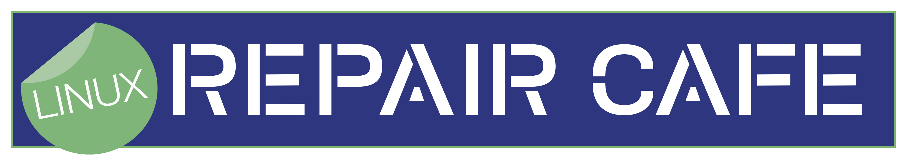
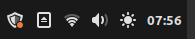
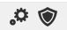
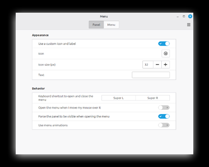
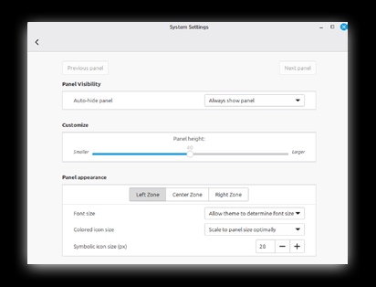
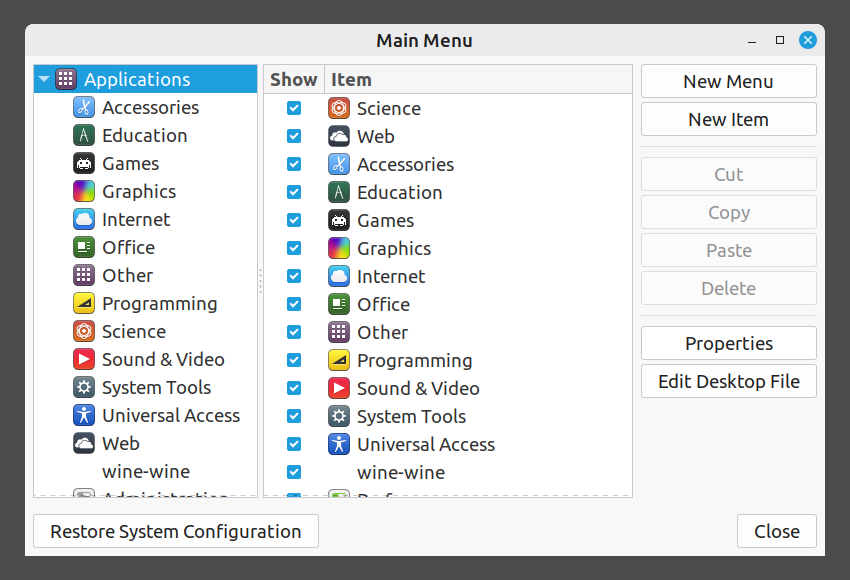

# Getting Started With Linux

Manual For Novice Users

> TOSS IT? NO WAY! REPAIRCAFE.ORG

Adapted from: https://www.repaircafe.org/en/repair-cafe-linux/

[![CC BY-NC-SA 4.0][cc-by-nc-sa-image]][cc-by-nc-sa]

[cc-by-nc-sa]: http://creativecommons.org/licenses/by-nc-sa/4.0/
[cc-by-nc-sa-image]: https://licensebuttons.net/l/by-nc-sa/4.0/88x31.png

## Introduction
Congratulations on your new Linux operating system! Your laptop will now last longer, you will be less dependent on commercial companies, and your privacy will be better protected.

This document will help you find your way around Linux Mint. It will help you complete the installation, configure the appearance, and answer any initial questions you may have. About half of the content covers things you only need to set up once. We hope this will help you get started quickly
with your "new" Linux computer.

The layout of this document is designed to aid readability:
- Program names look like this: <ins>Power Management</ins>.

👉 A pointing hand next to text indicates that you are going to perform actions on the computer.

Perhaps you have not worked with Linux before. Don't worry, you are not alone. There is an incredible amount of information about this operating system available online. If you have a question, chances are that someone else has already asked it—and received an answer. If you post a question on a forum, someone will usually help you within a day.

Below are a number of reliable, frequently used websites and forums:

English sources:
- [Official Website](https://linuxmint.com/)
- [Linux Mint Forum](https://forums.linuxmint.com/)
- [Tutorials / Guides](https://linuxmint-installation-guide.readthedocs.io/en/latest/)
- [Reddit](https://www.reddit.com/r/linuxmint/)

English-language sources (use <ins>Firefox</ins>'s translation function if you find English difficult).

- [Linux Mint Forum](https://forums.linuxmint.com/)
- [Ubuntu Questions & Answers](https://askubuntu.com/) – Linux Mint is based on Ubuntu. Many Ubuntu solutions can also
be used in Linux
- [LibreOffice Forum](https://ask.libreoffice.org/c/english/5)

Video material:
- [YouTube](https://www.youtube.com/) – search for specific topics, for example, "Linux Mint setup."

A search tip for the internet: start your search with: 'Linux Mint + [enter the topic here]'. For example: 'Linux Mint + change password'. This will help you avoid search results for other operating systems.

## Starting Linux Mint For The First Time

Linux Mint is installed on your computer as if it were brand new. After starting it up for the first time, a few more steps are needed to get your new system ready for use. You will now take those steps. It is also wise to install a few necessary additions right away, such as updates.

In this chapter, we will walk you through all the steps. Many of these actions only need to be performed once. If you do them correctly, you will benefit from them later. After these steps, your system will be ready for use.

Follow the steps calmly and at your own pace — you are almost ready to get started with Linux!

### Completing the installation

When you start the computer for the first time, you will go through a number of steps to get your system ready for use:

- Language settings - Choose the language in which you want the system to communicate with you. Choose the language you are most familiar with. You can always change this choice later.
- Keyboard layout – Choose the keyboard that corresponds with your keyboard.
- Wi-Fi network - If your computer is not connected with a network cable, it will ask for the Wi-Fi password. Enter the password for your router.
- Location - Confirm the default location (usually Amsterdam) or manually select another country or region.
- Username (account name) - This name is also used for your personal folder (e.g., /home/yourname).

	Choose a short, clear username that consists of:
	- Lowercase letters only
	- No spaces or punctuation marks
	- One word that is recognisable to you

- Password - Because you are also the administrator of your system, choose a strong password of at least eight characters with sufficient variation (numbers, capital letters, symbols). Choose a password that you can remember. Share it with someone you trust or write it down.
- Automatic login - If you select this option, you will not need to enter your password when you start up your computer. We do not recommend this, as it will give others immediate access to your computer.
- Encryption of your personal folder - We recommend enabling this option. Your data will then be stored in encrypted form, which offers extra protection in case your computer is lost or stolen. In some situations (such as administrative work for associations), this measure is even mandatory due to privacy legislation. You do not need an additional password for encryption.

> [!CAUTION]
> When encrypted, your data is truly encrypted. If you lose the password, you will no longer be able to recover your files. There is no magic trick to retrieve them. That is why we recommend choosing a password that you can remember and writing it down or sharing it with someone you trust.

### Installing updates

The version of Linux Mint installed on your computer is a snapshot. Since then, new updates have probably become available. Minor updates are released approximately every six months, major updates usually every two years. It is wise to install these updates immediately before continuing to explore your computer.

👉 Click on the security shield with the red dot in the panel.

The <ins>Update Manager</ins> screen will open.

👉 Click on "OK."

You will <ins>Update Manager</ins> screen again.

👉 Click on 'Refresh' at the top.

A message may appear stating that a new version of <ins>Update Manager</ins> is available. In that case:

👉 Click on 'Perform update'.

👉 Enter the password.

The <ins>Update Manager</ins> update itself is now being installed. Once it is complete:

👉 Click on 'Install Updates' at the top.

The updates will be downloaded and installed. This may take up to half an hour the first time, depending on your internet connection. Please wait patiently.

👉 Close the <ins>Update Manager</ins> screen.

From now on, updates will be performed automatically. This is visible in the bottom taskbar on the gear icon.

You can always force an update manually by clicking on the security shield. Some updates will only
become active after you restart your computer. You will receive a notification when this happens.

## Using Programs

Now that you have completed the installation and installed the latest updates, your computer is ready to use. The following chapters will help you get used to Linux. This chapter is about using programs.

### Opening programs

You can easily open programs via the Linux Mint menu. Here's how:

👉 Click on the Linux Mint icon at the bottom left of the screen or press the Windows key on your keyboard.

Click on the program you want to open.

For example: Menu > Preferences > Sound

### Adjusting the size

You can make the menu larger or smaller by dragging the edges.

### Searching for a program

There is a search field at the top of the menu.

👉 Type in a general term, such as: "text," "mail," "internet," "video," "print," "mouse," "player," "calculate," and so on.

The menu will display all programs related to the topic you typed. If you already know the name of the program, type it in directly.

### Starting programs

👉 Click on the name of the program to start it.

### Creating a shortcut on the desktop

👉 Right-click on the program in the menu.

Select 'Add to desktop' to create the shortcut.

### Browse categories

👉 Click on a category in the left column of the menu.

The right column shows all related programs.

👉 Click on a program to start it.

## Setting Up E-mail

To set up email, you need the username and password for your email account and an email program. Linux Mint comes with the Thunderbird email program.

👉 Start <ins>Thunderbird</ins> from the menu.

👉 Answer the questions that appear.

<ins>Thunderbird</ins> will automatically retrieve a number of email settings in the background.

If everything is filled in correctly, you will have quick access to your mailbox.

Having trouble? Consult the manual on automatic account configuration via the Mozilla website.

### Transferring your <ins>Thunderbird</ins> profile from another computer

Have you used <ins>Thunderbird</ins> on another computer before? If so, you can transfer your email settings, messages, and folders by transferring your profile. To do this, you need to make your profile folder visible in Linux. Here's how:

👉 Open <ins>Nemo</ins> (second icon from the left in the panel).

You will now see your personal folder.

👉 Press Ctrl + H to display hidden files.

Find the <ins>Thunderbird</ins> folder. This is where your profiles are stored.

Use this folder to transfer data from your old system, as described in the manual on Mozilla's website.

## Managing Files

In Linux Mint, you use the <ins>Files</ins> program (also known as <ins>Nemo</ins>) to open, search, and manage folders and files.

### Opening and searching for files

Open:

👉 Start <ins>Files</ins>

👉 Click on the second icon from the left in the taskbar at the bottom of the screen.

Search:

👉 Click on the magnifying glass in the top right corner to open the search window.

👉 Type (part of) the file name.

Searches are not case sensitive – this is indicated by the Aa icon. By default, the program also searches in subfolders. This is indicated by the L-shaped arrow pointing to the right.

### Deleting files

If you delete a file using the right-click menu or the Delete key, it will first be moved to the recycle bin. If you also delete it from the recycle bin, the file will be permanently deleted. Unlike Windows, Linux does not have any simple programs for recovering deleted files.

### Want to know more about the <ins>Nemo</ins> program?

See the detailed explanation at: https://community.linuxmint.com/software/view/nemo

## Installing And Removing Programs

With a few simple steps, you can install new programs or remove existing software in Linux Mint. You can do this via <ins>Software Manager</ins>. We explain how to do this step by step.

### Installing a program

👉 Press the Windows key or click on the menu at the bottom left.

👉 Type "soft" in the search field or find <ins>Software Manager</ins> via Menu > Administration > <ins>Software Manager</ins>.

👉 Click on <ins>Software Manager</ins> in the list of results.

The program will open with the message: 'Loading, please wait.' Wait a moment until the content is fully loaded and you can see your programs.

👉 Type 'screen' in the search field of <ins>Software Manager</ins>.

You will now see an overview of all programs related to screen. Search the list for <ins>Simple Screen Recorder</ins>. This program makes a video recording of your desktop while you work.

👉 Click on the name to open the program.

👉 Click the "Install" button to install the program.

You may be asked to enter the password.

After installation, the program will be available via the menu.

When you click on a program in <ins>Software Manager</ins>, an overview screen with more information will open. At the top right, you will see the 'Install' button (or 'Uninstall' if the program is already installed).

### Uninstalling a program

👉 Open <ins>Software Manager</ins>.

Find the program as you did when installing it.

Instead of the 'Install' button, you will now see the 'Uninstall' button.

👉 Click on 'Uninstall'. The program will be removed from your system.

## Common Applications

Your computer is now ready to use. Time to get started with everyday tasks. With our clear explanations and handy tips, we help you get the most out of your Linux system.

### OneDrive storage
With the <ins>OneDrive</ins> or <ins>Rclone</ins> programs, you can connect your OneDrive cloud storage to your Linux computer. Install the program via <ins>Software Manager</ins>.

For more information about using <ins>OneDrive</ins>, see this [page](https://ubuntuhandbook.org/index.php/2024/02/install-onedrive-ubuntu/).

### Attending Teams or Zoom meetings

We recommend following the meeting via the <ins>Firefox</ins> web browser or installing an app on a phone or tablet. To install Microsoft Teams or Zoom in <ins>Software Management</ins> turn on ‘unverified flatpaks’ in the software store. Read about the security implications on [Linux Mint forums](https://forums.linuxmint.com/viewtopic.php?t=421334).

### Reading an e-book
There are various readers you can install, such as <ins>FBReader</ins>. Check with your local library whether the reader is compatible.

### Playing a DVD
Use <ins>VLC Media Player</ins> if you want to play a DVD. Install <ins>VLC Media Player</ins> according to the steps in the chapter 'Installing and removing programs'.

### Using the touchpad
Slide two fingers across the touchpad at the same time. You cannot scroll using the side or bottom of the touchpad.

### Multiple screens: watching video on a TV or projector

Connect your computer to the TV with an HDMI cable. Set the TV source to the correct HDMI input. Linux will then find the TV screen and copy it to your laptop screen.

The sound from the laptop will also automatically go to the HDMI output. If you don't want this, you can send it to the computer's speakers. To do this, follow these steps:

👉 Press the Windows key.

👉 Find the <ins>Sound</ins> program and start it by clicking on it.

👉 Go to the "Output" tab.

👉 Click on 'Built-in speakers'.

If you want the TV screen to be an extension of the laptop screen, do the following:

👉 Press the Windows key.

👉 Find the <ins>Display</ins> program.

👉 Click on it.

👉 Click on 'Merge screens'.

👉 Click and drag screen two to the desired position relative to the laptop screen.

👉 Click on 'Apply'.

👉 Close Display.

### Connecting a printer
You can connect a printer with a cable or via Wi-Fi. Plug the cable directly into the computer; if using Wi-Fi, make sure the computer and printer are connected to the same network. Most printers are automatically recognised as soon as you connect them to the network. You can easily add a new printer via the "Printers" menu.

Mint often selects the correct driver itself. For brands such as HP, Canon, or Epson, additional drivers are sometimes required. You can install these via <ins>Software Manager</ins> or the manufacturer's website. Once the printer has been added, you can start printing immediately.

## Adjusting Settings 

In Linux Mint, you can customise many settings to your liking: from fonts and icon size to backgrounds, colours, and the panel. These adjustments are not only to make your work environment look nicer. They also make it more user-friendly: if you have poor eyesight, for example, you can enlarge the default font. Follow the steps and customise your system to your liking and convenience.

### Display and fonts
### Font size of windows
Go to <ins>System Settings</ins> and select <ins>Fonts</ins> to adjust the display of text in windows. Increasing the default font size significantly improves readability for people with visual impairments. Please note: adjusting the document font usually has little effect, as many programs use their own settings for font and font size.

### Desktop background
Start <ins>Backgrounds</ins> from <ins>System Settings</ins>. Just try a few things out.

To set a solid colour:

👉 Click on the 'Settings' tab.

👉 Click on 'No picture'.

👉 Use the colour icon to choose a colour.

👉 Choose 'Solid colour' or 'Horizontal/vertical gradient' for extra effect.

### Enlarge icons in the Linux Mint menu

👉 Right-click on the Linux Mint icon.

👉 Select ' set '.

<!-- TODO: localise screenshot -->

👉 Click on – or + to increase or decrease the size of the Linux Mint icon.

### Desktop and taskbar

### Setting up icons on the desktop

Would you like to place icons on your desktop, such as the recycle bin or the computer? These function as shortcuts.

Go to <ins>System Settings</ins>, start <ins>Desktop</ins>, and check the desired options.

When you click on the "Computer" icon, a window opens showing the various drives, connected devices, and sometimes network resources. This is similar to "This PC" or "My Computer" in Windows.

### Customise the panel at the bottom of the desktop

Start <ins>Panel</ins> from <ins>System Settings</ins>.

The panel turns pink to indicate that you are in edit mode. The changes are immediately visible.

👉 Drag the 'Panel height' to a comfortable height.

<!-- TODO: localise screenshot -->

👉 Exit the screen using the left arrow at the top left of the screen.

The taskbar will return to its normal colour, and you will be back in normal working mode.

### Components of the Linux Mint menu

Here you can turn the visibility of programs on and off; they will then appear or not appear in the menu. If you only set up the programs you use, the menu will be clearer. Please note: the icons will also no longer appear in the search results when you type something in the search window.

👉 Right-click on the Linux Mint icon.

👉 Select 'Edit Menu'.You now see this screen.

<!-- TODO: localise screenshot -->

You can always make the programs visible again. To do this, open the <ins>Main Menu</ins> and check the box for the program under the category where you expect it to be. Then click on 'Close'.

### System settings

Most of your system settings can be easily found via the Linux Main Menu:

👉 Open the Linux Main Menu.

👉 Type 'System' in the search window.

👉 Click on <ins>System Settings</ins>.

In this menu, you can click on various icons to adjust settings for display, sound, and network.

### Power Management

The <ins>Power Management</ins> program allows you to control three things.

- What your laptop does when you close it: go into sleep mode or shut down.
- How the on/off button behaves. The following options are available: the button does nothing, the screen turns off, the laptop goes into sleep or hibernation mode, or the system shuts down.
- Power management for battery and mains power. Among other things, you can set the transition between battery and mains power and when the laptop goes into energy-saving mode.
