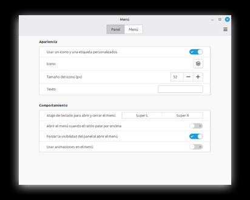
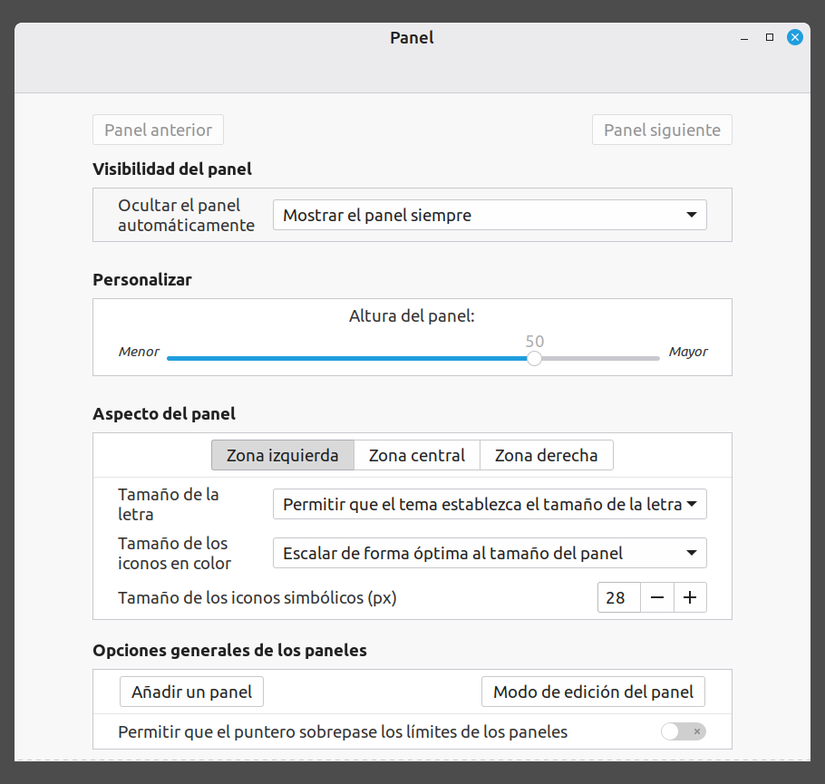
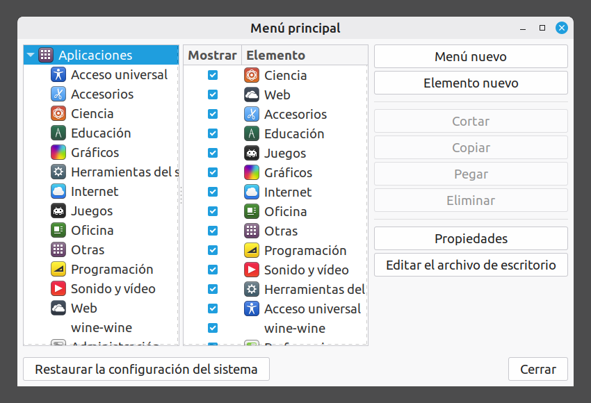

# Comenzar Con Linux

Manual Para Usuarios Principiantes

> ¿TIRARLO? ¡NI PENSARLO! REPAIRCAFE.ORG

Adaptación de: https://www.repaircafe.org/es/repair-cafe-linux/

[![CC BY-NC-SA 4.0][cc-by-nc-sa-image]][cc-by-nc-sa]

[cc-by-nc-sa]: http://creativecommons.org/licenses/by-nc-sa/4.0/
[cc-by-nc-sa-image]: https://licensebuttons.net/l/by-nc-sa/4.0/88x31.png

## Introducción
¡Felicidades por tu nuevo sistema operativo Linux! Tu portátil ahora tendrá una vida más larga, dependerás menos de las empresas comerciales y tu privacidad estará más garantizada.

Este documento te ayuda a usar Linux Mint. Te ayuda con la finalización de la instalación,
configurar la apariencia y contestar a las primeras preguntas que te puedan surgir. Más o menos la mitad del contenido trata de asuntos que sólo requieren una única configuración. Esperamos que de esta forma puedas tener un arranque suave con el uso de tu ´nuevo´ ordenador Linux.

El formato usado en este documento es una ayuda para la lectura:

- Los nombres de los programas están incluidos de esta forma: <ins>Gestor de energía</ins>.
👉 Una mano que señala al texto indica que vas a ejecutar acciones en el ordenador.

Quizás no hayas trabajado nunca con Linux. No pasa nada, no estás solo. Se puede encontrar
mucha información online sobre este sistema operativo. Si tienes una duda, es muy probable que alguna otra persona ya la haya formulado anteriormente – y haya obtenido respuesta. Si publicas tu duda en un foro, normalmente alguien te ayudará en un plazo de un día.

Aquí abajo encontrarás unas cuantas páginas web y foros fiables y muy frecuentadas:

Fuentes en español

- [Foro oficial de Linux Mint](https://forums.linuxmint.com/viewforum.php?f=68&)
- [Manual de usuario](https://www.calameo.com/books/004952720d469b448f64d)

Fuentes en inglés (usa la función de traducción de <ins>Firefox</ins> si te cuesta el inglés).

- [Linux Mint Forum](https://forums.linuxmint.com/)
- [Ubuntu Pregunta y Respuesta](https://askubuntu.com/) – Linux Mint está basado en Ubuntu. Muchas soluciones Ubuntu
también se pueden usar en Linux
- [LibreOffice Forum](https://ask.libreoffice.org/c/english/5)

Materiales de video:

- [YouTube](https://www.youtube.com/) – busca un tema específico, por ejemplo ‘configurar Linux Mint’

Un consejo de búsqueda para internet: comienza tu consulta de búsqueda con: ‘Linux Mint +
[incluye el tema]’. Por ejemplo: ‘Linux Mint + cambiar contraseña’. De esta forma evitas resultados de búsqueda para otros sistemas operativos.

## Poner En Marcha La Primera Vez
Linux Mint está instalado en tu ordenador como si acabase de salir nuevo del comercio. Después de ponerlo en marcha la primera vez requiere algunos pasos para que tu nuevo sistema queda listo para usar, quizá se hayan tomado ya estos pasos en el Linux Repair Cafe. Si no, te aconsejamos configurar en este momento algunas adiciones necesarias, como actualizaciones.

En este capítulo repasamos todas las partes paso a paso. Muchas de estas acciones sólo requieren ejecutarse una única vez. Tras ejecutar estos pasos tu sistema estará listo para usar.

Sigue los pasos tranquilamente y a tu propio ritmo — ¡estás casi listo para comenzar con Linux!

### Finalizar la instalación

Cuando inicias el ordenador por primera vez, tienes que seguir unos cuantos pasos para que tu sistema quede listo para usar:

- Configuración de idioma. Escoge la lengua en la que quieres que el sistema se comunique contigo.
Escoge el idioma más familiar para ti. Siempre puedes adaptarlo.
- Disposición de teclado. Elige el teclado que corresponda con tu teclado.
- Red de wifi. Si tu ordenador no está conectado con un cable de red, te preguntará por la
contraseña de wifi. Teclea la contraseña de tu enrutador.
- Ubicación. Confirma la ubicación estándar (suele ser Ámsterdam) o escoge manualmente otro país u otra región.
- Nombre de usuario (nombre de cuenta). Este nombre también se utiliza para tu archivo personal (por ejemplo . /home/tu nombre). Escoge un nombre de usuario corto, claro que consiste en:
	- Sólo minúsculas
	- Sin espacios o signos de puntuación
	- Una palabra que sea reconocible para ti
- Contraseña. Como también eres el administrador de tu sistema, escoge una contraseña fuerte de mínimo doce carácteres y con suficiente variación (cifras, mayúsculas, símbolos). Escoge una contraseña que vayas poder recordar, prueba escogiendo una oración que recuerdes, en vez de letras/cifras aleatorias. Compártela con alguien a quien confías o escríbela.

> tortugas del bosque leen libros amaneciendo

- Iniciar sesión automáticamente. Si seleccionas esta opción, no tendrás que incluir tu contraseña al iniciar sesión. Lo desaconsejamos, ya que tu ordenador es libremente accesible para otras personas.
- Encriptación de tu archivo personal. Te aconsejamos habilitar esta opción. Tus datos se guardarán de forma encriptada, lo que ofrece una protección adicional en caso de pérdida o robo de tu ordenador. En algunas situaciones esta medida es obligatoria bajo legislación de privacidad (como trabajo administrativo para asociaciones). Para la encriptación no necesitas una contraseña
adicional.

> [!CAUTION]
> En caso de encriptación los datos son encriptados de verdad. Si perdieras la contraseña, ya no podrás recuperar los archivos. No existe un truco mágico para recuperarlos. Por esta razón nuestro consejo de escoger una contraseña que puedas memorizar, y de escribirla en algún sitio o compartirla con alguien en quien confíes.

### Instalar actualizaciones
La versión de Linux Mint que has instalado en tu ordenador, consiste en una captura instantánea. Actualizaciones críticas y correciones de errores se emiten frequentemente (diario/semanal), por lo que nuevas actualizaciones probablemente estén disponibles. Es prudente instalar estas actualizaciones antes de continuar explorando tu ordenador.

👉 Haga clic en el escudo de seguridad con el punto rojo en el panel.

Se abre la pantalla Gestor de actualizaciones.

👉 Haga clic en ‘OK’.

Volverás a ver la pantalla de Gestor de actualizaciones.

👉 En la parte superior haga clic en ‘Renovar’.

Te puede salir un aviso que está disponible una nueva versión de Gestor de actualizaciones. En ese caso:

👉 Haga clic en ‘Ejecutar actualización’.

👉 Incluye la contraseña.

Se instalará ahora la actualización de Gestor de actualizaciones. Cuando haya finalizado:

👉 En la parte superior haga clic en ‘Instalar actualización’.

Se bajarán e instalarán las actualizaciones. La primera vez puede tardar hasta media hora,
dependiendo de tu conexión de internet. Espera tranquilamente.

👉 Cierra la ventana Gestor de actualizaciones.

Desde este momento las actualizaciones se ejecutarán automáticamente. Esto es visible en la barra de tareas inferior en el icono de rueda dentada.

Siempre puedes forzar de forma manual una actualización haciendo clic en el escudo de
seguridad. Por cierto, ciertas actualizaciones no se activan hasta un reinicio de tu ordenador. Recibirás una notificación sobre esto.

## Usar Los Programas

Ahora que has finalizado la instalación y además has instalado las últimas actualizaciones, tu ordenador está listo para usar. Los siguientes capítulos te ayudan con la adaptación a Linux. Este capítulo va sobre el uso de programas.

### Iniciar programas

Puedes iniciar programas fácilmente desde el menú de Linux Mint. Se hace así:

👉 Haga clic en el icono Linux Mint incluido en la parte inferior izquierda de la pantalla o en la tecla Windows en tu teclado.

Haz clic en el programa que deseas abrir.

Por ejemplo: Menú > Preferencias > Sonido

### Adaptar el formato

Puedes hacer el menú más grande o más pequeño arrastrando los bordes.

### Buscar un programa

En la parte superior del menú se encuentra un campo de búsqueda.

👉 Teclea un término general como: ‘texto’, ‘correo electrónico’, ‘internet’, ‘video’, ‘copia’, ‘ratón’, ‘reproductor’, ‘calcula’, etcétera.

El menú muestra todos los programas relacionados con el tema que tú has tecleado. ¿ya sabes el nombre del programa? Tecléalo directamente.

### Iniciar programas

👉 Haga clic en el nombre del programa para iniciarlo.

### Crear un acceso directo en el escritorio

👉 Haga clic derecho en el programa en el menú.

👉 Escoge ‘Añadir a la hoja de trabajo’ para crear el acceso directo.

### Navegar por categorías

👉 Haga clic en una categoría en la columna izquierda del menú.

La columna derecha mostrará todos los programas asociados.

👉 Haga clic en un programa para iniciarlo.

## Configurar El Correo Electrónico

Para acceder a tu email puedes visitar la página web de tu proveedor de email a través de tu navegador web. Opcionalmente, puedes configurar un cliente email como <ins>Thunderbird</ins>.

Para configurar <ins>Thunderbird</ins>, necesitas el usuario (normalmente el email) y la contraseña de tu cuenta email.

👉 Inicia <ins>Thunderbird</ins> mediante el menú.

👉 Contesta las preguntas que aparecen.

Al fondo <ins>Thunderbird</ins> recupera automáticamente una serie de configuraciones de correo electrónico.

Si has completado todo correctamente, tendrás rápidamente acceso a tu buzón de correo
electrónico.

¿No lo consigues? Consulta el manual sobre configuración automática de la cuenta mediante la [página web de Mozilla](https://support.mozilla.org/es/kb/configuracion-automatica-de-las-cuentas?utm_source=chatgpt.com).

> Utiliza la función importar/exportar de <ins>Thunderbird</ins> si deseas copiar tus emails de <ins>Thunderbird</ins> otro ordenador.

## Administrar Archivos

En Linux Mint se utiliza el programa <ins>Archivos</ins> (también llamado <ins>Nemo</ins>) para abrir, buscar y administrar carpetas y archivos.

### Abrir y buscar archivos

Abrir:

Inicia <ins>Archivos</ins>

👉 Haga clic en el segundo pictograma de la izquierda en la barra de tareas en la parte inferior de la pantalla.

Buscar:

👉 Haga clic en la lupa en la parte superior derecha para abrir la ventana de búsqueda.

👉 Teclea (una parte del) nombre de archivo.

La búsqueda no distingue entre mayúsculas y minúsculas – lo indica el pictograma Aa. De forma predeterminada el programa también busca en subcarpetas. Lo indica la flecha en forma de L que apunta hacia la derecha.

### Eliminar archivos

¿Se elimina un archivo mediante el menú del botón derecho o la tecla de Suprimir? Entonces primero se transfiere a la papelera. Si también lo eliminas de la papelera, el archivo será eliminado definitivamente. A diferencia de Windows en Linux no hay programas sencillos para poder recuperar archivos eliminados.

### ¿Quieres saber más sobre el programa <ins>Nemo</ins>?
Ve la explicación detallada en:

https://community.linuxmint.com/software/view/nemo

## Instalar Y Eliminar Programas

Con unos cuantos pasos simples puedes instalar en Linux Mint nuevos programas o eliminar software existente. Esto lo puedes hacer mediante <ins>Gestor de software</ins>. Te explicamos paso a paso como proceder.

### Instalar un programa

👉 Presiona la tecla Windows o haz clic abajo a la izquierda del menú.

👉 Teclea ‘gest’ en el campo de búsqueda o busca el Gestor de Software a través de Menú > Administración > Gestor de Software.

👉 Haga clic en <ins>Gestor de software</ins> en la lista con resultados.

El programa se inicia con el aviso: ‘Cargando, espere por favor.’ Espera a que se haya cargado todo el contenido y veas los programas.

👉 Teclea en el campo de búsqueda de <ins>Gestor de software</ins> ‘screen’.

Te aparecerá un listado de todos los programas relacionados con ´screen´. Busca en la lista <ins>Simple Screen Recorder</ins>. Este programa realiza una grabación de video de tu escritorio mientras trabajas.

👉 Haga clic en el nombre para iniciar el programa.

👉 Haga clic en el botón ‘Instalar’ para instalar el programa.

Puede ser que te pida que insertes la contraseña.

Tras la instalación el programa estará disponible mediante el menú.

Si haces clic en un programa dentro de <ins>Gestor de software</ins>, se abrirá una ventana de descripción general con más información. En la parte superior derecha verás el botón ‘Instalar’ (o ‘Eliminar’ si el programa ya está instalado).

### Eliminar un programa

👉 Inicia <ins>Gestor de software</ins>.

Busca el programa de la misma forma que has hecho al instalar.

En vez del botón ‘Instalar’ verás el botón ‘Eliminar’.

👉 Haga clic en ‘Eliminar’. El programa será eliminado de tu sistema.

## Aplicaciones Comunes

Tu ordenador está listo para usar. Es momento para comenzar a usarlo para tus tareas cotidianas. Con nuestra explicación clara y consejos prácticos te ayudaremos a sacar el máximo de tu sistema Linux.

### Almacenamiento OneDrive

Con los programas <ins>OneDrive</ins> en <ins>Rclone</ins> puedes conectar tu almacenamiento en la nube OneDrive con tu ordenador Linux. Instala el programa mediante <ins>Gestor de software</ins>.

Para una explicación más detallada sobre el uso de <ins>OneDrive</ins> consulta [esta página](https://forums.linuxmint.com/viewtopic.php?t=409957).

### Participar en reuniones de Teams o Zoom

Recomendamos seguir la reunión mediante el navegador web <ins>Firefox</ins> o instalar una aplicación en un teléfono o tableta. Para instalar Microsoft Teams o Zoom en la <ins>Gestor de software</ins>, activa los «flatpaks no verificados» en la tienda de software. Lee sobre las implicaciones de seguridad en los foros de Linux Mint.

### Leer un libro electrónico

Hay varios lectores para instalar, por ejemplo <ins>FBReader</ins>. Consulta con tu biblioteca local si el lector es compatible.

### Reproducir un dvd

Usa <ins>VLC Media Player</ins> si deseas reproducir un DVD. Instala <ins>VLC Media Player</ins> siguiendo los pasos del capítulo «Instalar y eliminar programas».

### Usar el panel táctil

Desliza simultáneamente dos dedos sobre el panel táctil. No es posible desplazarse utilizando los lados o la parte inferior del panel táctil.

### Múltiples pantallas: ver un en un televisor o proyector

Conecta tu ordenador con el televisor mediante un cable HDMI. Configure la fuente del televisor en la entrada HDMI correcta. Linux encontrará la pantalla del televisor y la copiará a tu pantalla del portátil.

El sonido del portátil también irá automáticamente a la entrada HDMI. Si eso no es lo que deseas, puedes enviarlo a los altavoces del ordenador. Eso se hace de la siguiente manera:

👉 Presiona la tecla Windows.

👉 Busca el programa <ins>Sonido</ins> e inícialo haciendo clic.

👉 Vaya a la pestaña ‘Salida’.

👉 Haga clic en ‘Altavoces incorporados´.

Si el objetivo es que la pantalla del televisor sea una extensión de la pantalla del portátil, puedes hacer lo siguiente:

👉 Presiona la tecla Windows.

👉 Busca el programa <ins>Pantalla</ins>.

👉 Haga clic.

👉 Haga clic en ‘Unir pantallas’.

👉 Haga clic y arrastre la segunda pantalla al sitio deseado con respecto a la pantalla del portátil.

👉 Haga clic en ‘Aplicar’.
👉 Cierra <ins>Pantalla</ins>.

### Conectar una impresora

Puedes conectar una impresora con un cable o mediante wifi. Un cable lo conectas directamente con el ordenador; mediante wifi tienes que asegurarte que el ordenador y la impresora están conectados con la misma red. La mayoría de las impresoras son reconocidas de forma automática cuando las conectas con la red. Mediante el menú ‘Impresoras’ puedes añadir fácilmente una nueva impresora.

A menudo Mint escoge automáticamente el programa controlador correcto. Para marcas como HP, Canon o Epson a veces se necesitas controladores adicionales. Estos se pueden instalar mediante <ins>Gestor de software</ins> o la página web del fabricante. En cuanto hayas añadido la impresora, puedes imprimir directamente.

## Ajustar La Configuración

En Linux Mint puedes configurar muchas cosas a tu gusto: desde tipos de letras y tamaño de
pictogramas a fondos de pantalla, colores y el panel. Estos ajustes no son sólo para hacer tu entorno de trabajo más agradable. También lo hacen más fácil de manejar: si ves peor, puedes por ejemplo hacer más grande el tamaño de letra estándar. Sigue los pasos y adapta el sistema a tu gusto y comodidad.

### Pantalla y tipos de letras

### Tamaño de fuentes de la ventana

Mediante <ins>Configuración del sistema</ins> puedes ir a <ins>Tipos de letras</ins> para configurar la manera como se muestra el texto en las fuentes de ventana. Haciendo el tamaño del tipo de letra estándar más grande, mejoras la legibilidad para personas con discapacidad visual considerablemente. Ten en cuenta: adaptar el tipo de letra para documentos suele tener poco efecto: muchos programas suelen usar sus propios ajustes para tipos de letras y tamaños de letras.

### Fondo de pantalla de escritorio
Desde <ins>Configuración del sistema<ins> puedes iniciar <ins>Fondos</ins>. Prueba unas cuantas cosas. Para configurar un color sólido:

👉 Haga clic en la pestaña ‘Configuración’.

👉 Haga clic en ‘Sin imagen’.

👉 Usa el icono de color para escoger un color.

👉 Escoge ‘Color sólido’ o ‘Degradado de color horizontal/vertical’ para un efecto adicional.

### Agrandar pictogramas del menú Linux Mint

👉 Haga clic derecho en el pictograma de Linux Mint. Haga clic en "apariencia"

👉 Ajuste los iconos a su preferencia

👉 Cierre la ventana de ajustes

<!-- TODO: localise screenshot -->

👉 Haga clic en – o + para hacer el tamaño del pictograma de Linux Mint más grande o más pequeño.

### Escritorio y barra de tareas

### Configurar pictogramas en el escritorio

¿Quieres añadir pictogramas en tu escritorio, como la papelera o el ordenador? Estos funcionan como atajos de teclado.

Vete a <ins>Configuración del sistema</ins>, inicia <ins>Escritorio</ins> y confirma lo que desees.

Si pulsas el pictograma ‘Ordenador’, se abrirá una pantalla donde podrás ver los distintos discos, dispositivos conectados y a veces también fuentes de red. Esto es comparable con ‘Este ordenador’ o ‘Mi ordenador’ en Windows.

### Adaptar el panel en la parte inferior del escritorio

Desde <ins>Configuración del sistema<ins> inicia <ins>Panel</ins>.

El panel cambia a color rosa para indicar que estás en modo de edición. Estos cambios son visibles directamente.

👉 Desliza la ‘Altura del panel’ a una altura cómoda.

<!-- TODO: localise screenshot -->

👉 Sale de la pantalla mediante la flecha izquierda en la parte superior izquierda de la pantalla.

La barra de tareas retomará su color normal, has vuelto a la situación de trabajo normal.

### Partes del menú Linux Mint

Aquí puedes encender o apagar la visibilidad de programas, dependiendo de tu elección aparecerán o no en el menú. Si sólo configuras programas que usas realmente, el menú será más claro. Ten en cuenta: los pictogramas no saldrán más en los resultados de búsqueda si tecleas algo en el campo de búsqueda.

👉 Haga clic derecho en el pictograma de Linux Mint.

👉 Escoge ‘Editar menú’. Ahora verás esta ventana.

<!-- TODO: localise screenshot -->

Siempre puedes decidir hacer estos programas otra vez visibles. Esto se hace abriendo el Menú principal y activando el programa de nuevo en la categoría donde esperas tú el programa. Después haz clic en ‘Cerrar’.

### Configuración del sistema

La mayoría de las configuraciones de tu sistema las puedes encontrar fácilmente mediante el Menú principal de Linux:

👉 Abre el Menú principal de Linux.

👉 Teclea ‘Sistema’ en el campo de búsqueda.

👉 Haz clic en <ins>Configuración del sistema</ins>.

En este menú podrás hacer clic en diferentes pictogramas para poder adaptar configuraciones para pantalla, sonido y red.

### Gestor de energía

Con el programa Gestor de energía podrás solucionar tres cosas.

- Lo que hace tu portátil cuando lo pliegas: en modo pausa o que se apague.
- La manera de comportarse el botón de apagar/encender. Hay las siguientes opciones: el botón no hace nada, la pantalla se apaga, el portátil entra en modo de suspensión o letargo o el sistema se apaga.
- La gestión energética para batería y fuente de alimentación. Entre otras cosas puedes configurar la transición entre la batería y fuente de alimentación y en qué momento pasa el portátil a un modo de ahorro energético.