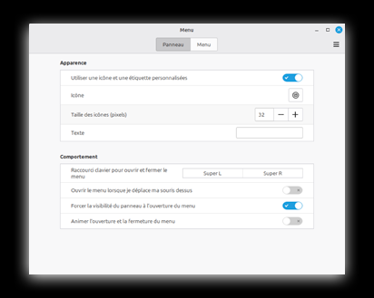
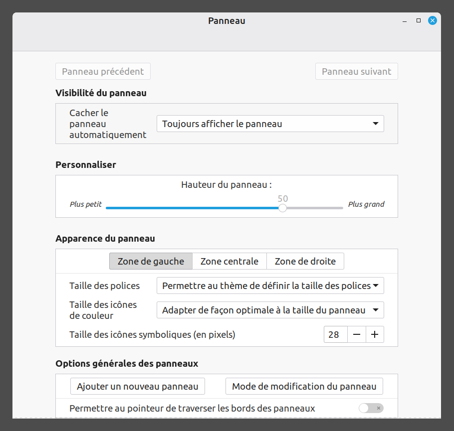
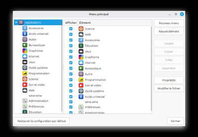

# Débuter Avec Linux

Manuel Pour Les Utilisateurs Débutants

> JETER ? PAS QUESTION ! REPAIRCAFE.ORG

Adapté de: https://www.repaircafe.org/fr/repair-cafe-linux/

[![CC BY-NC-SA 4.0][cc-by-nc-sa-image]][cc-by-nc-sa]

[cc-by-nc-sa]: http://creativecommons.org/licenses/by-nc-sa/4.0/
[cc-by-nc-sa-image]: https://licensebuttons.net/l/by-nc-sa/4.0/88x31.png

## Préambule
Félicitations pour votre nouveau système d’exploitation Linux ! Vous prolongez la durée de vie de votre ordinateur portable, vous êtes moins dépendant des entreprises commerciales et vous protégez mieux votre vie privée.

Ce document vous aide à vous familiariser avec Linux Mint. Il vous aide à finir l’installation, à configurer l'apparence et à répondre aux premières questions que vous pourriez avoir. Environ la moitié du contenu concerne des éléments à ne configurer qu’une seule fois. Nous espérons que cela vous permettra de démarrer facilement avec votre « nouvel » ordinateur Linux

La mise en forme du document est conçue pour améliorer la lecture :

- Les noms des programmes ressemblent à cela : <ins>Gestion de l'énergie</ins>.

👉 Une main qui pointe dans le texte signifie que vous allez effectuer des actions sur l’ordinateur.

Vous n’avez peut-être jamais travaillé avec Linux par le passé. Pas de panique, vous n’êtes pas seul ! Vous pourrez trouver une quantité incroyable d’informations en ligne sur ce système d’exploitation. Si vous avez une question, il est très probable qu’elle ait déjà été posée, et obtenu une réponse. Lorsque vous publiez une question sur un forum, vous aurez probablement une réponse dans les 24h.

Veuillez trouver ci-dessous une liste de plusieurs sites web et forums fiables et très utilisés :

Sources en langue française :
- [Linux Mint Forums – Section française](https://forums.linuxmint.com/viewforum.php?f=63)
- [Forum Francophone Linux Mint](https://forum-francophone-linuxmint.fr/)
- [Documentation officielle de Linux Mint](https://linuxmint.com/documentation.php)

Les sources en langue anglaise (utilisez la fonction traduction de <ins>Firefox</ins> si vous ne maitrisez pas bien l’anglais).

- [Linux Mint Forum](https://forums.linuxmint.com/)
- [Ubuntu Questions & réponses](https://askubuntu.com/) – Linux Mint est basé sur Ubuntu. De nombreuses solutions
Ubuntu sont également utilisables dans Linux
- [LibreOffice Forum](https://ask.libreoffice.org/c/english/5)

Matériel vidéo :

• [YouTube](https://www.youtube.com/) – cherchez des sujets précis, par exemple « Paramétrer Linux Mint »

Astuce de recherche pour internet : commencez votre recherche avec : « Linux Mint + [saisissez ici le sujet] ». Par exemple : « Linux Mint + modifier son mot de passe ». Vous évitez ainsi tous les résultats de recherche pour d'autres systèmes d’exploitation.

## Démarrer La Première Fois

Linux Mint est installé sur votre ordinateur comme si celui sortait tout neuf du magasin. Après le premier démarrage, quelques étapes supplémentaires sont nécessaires pour rendre votre nouveau système prêt à l’emploi. Vous allez les faire maintenant. Il est également recommandé d’installer immédiatement quelques compléments indispensables, comme les mises à jour.

Ce chapitre permet de passer en revue toutes les étapes pas à pas avec vous. Beaucoup de ces actions ne sont nécessaires qu’une une seule fois. Si vous les effectuez correctement, vous en profiterez plus tard. Une fois ces étapes finies, votre système est prêt à être utilisé.

Suivez les étapes calmement et à votre rythme - vous êtes presque prêt à démarrer l’utilisation de Linux !

### Finalisation de l’installation

Lorsque vous démarrez l’ordinateur la première fois, vous passez en revue plusieurs étapes pour rendre votre système prêt à l’emploi :

- Choix de la langue. Choisissez la langue de communication du système avec vous. Choisissez la langue dans laquelle vous êtes le plus à l'aise. Vous pourrez modifier ce choix ultérieurement.
- Configuration du clavier. Choisissez le clavier qui correspond à votre clavier.
- Réseau Wifi. Lorsque votre ordinateur n’est pas connecté avec un câble réseau, il vous demandera un mot de passe pour le Wifi. Saisissez le mot de passe de votre routeur.
- Emplacement. Confirmez l’emplacement par défaut (la plupart du temps Amsterdam) ou choisissez
manuellement un autre pays ou une autre région.
- Nom d’utilisateur (nom de compte). C’est le nom qui sera également utilisé pour votre dossier personnel (ex. /accueil/votrenom). Choisissez un nom d’utilisateur court et clair qui se compose :
	- Uniquement des lettres minuscules
	- Sans espace ni signe de ponctuation
	- Un mot reconnaissable pour vous
- Mot de passe. Comme vous êtes également l’administrateur de votre système, choisissez un mot de passe fort, contenant au moins huit caractères, avec suffisamment de variété (chiffres, majuscules, symboles). Choisissez un mot de passe facilement mémorisable. Partagez-le avec une personne de confiance ou écrivez-le quelque part.
- Connexion automatique. Si vous faites ce choix, vous n'aurez pas à saisir votre mot de passe au démarrage. Nous déconseillons cette possibilité qui rend votre ordinateur directement accessible à autrui.
- Chiffrement de votre dossier personnel. Nous vous conseillons d'activer cette option. Vos données seront alors stockées de façon chiffrée, ce qui offre une protection supplémentaire en cas de perte ou de vol de votre ordinateur. Cette mesure est même obligatoire dans certaines situations (comme le travail administratif pour des associations), en raison de la législation sur la protection de la vie privée. Pour ce
chiffrage un mot de passe supplémentaire est nécessaire.

> [!CAUTION]
> Lors du chiffrage, vos données sont véritablement chiffrées. Si vous perdez votre mot de passe, vous ne pouvez plus récupérer vos fichiers. Il n’y a aucune astuce miracle pour les récupérer. D’où la suggestion de choisir un mot de passe mémorisable, et de l'écrire quelque part et de le partager avec une personne de confiance.

### Installer les mises à jour
La version de Linux Mint qui est installée sur votre ordinateur est comme une photo à un moment donné. Depuis, il y a sans doute eu de nouvelles mises à jour. Des petites mises à jour interviennent tous les six mois, les mises à jour plus importantes tous les deux ans. Il est conseillé d’installer ces mises à jour sans attendre avant de poursuivre l’exploration de votre ordinateur.

👉 Cliquez sur le bouclier de sécurité avec le point rouge dans le panneau.

L’écran <ins>Gestionnaire de mise à jour</ins> (parfois cela s'appelle <ins>Update Manager</ins>) apparait.

👉 Cliquez sur « OK ».

L'écran <ins>Gestionnaire de mise à jour</ins> réapparait.

👉 Cliquez sur la partie supérieure sur « rafraichir ».

Il se peut qu’un message indique qu’une nouvelle version du Gestionnaire de mise à jour est disponible, dans ce cas :

👉 Cliquez sur « Effectuer la mise à jour ».

👉 Saisissez le mot de passe.

La mise à jour du <ins>Gestionnaire de mises à jour</ins> est en cours d’installation. Une fois celle-ci finie :

👉 Cliquez tout en haut sur « Installer les mises à jour ».

Les mises à jour sont téléchargées et installées. La première fois, cela peut prendre jusqu’à une demi-heure, selon votre connexion internet. Patientez tranquillement.

👉 Fermez la fenêtre <ins>Gestionnaire de mise à jour</ins>.

Désormais les mises à jour seront effectuées automatiquement. Ceci est visible dans la barre des tâches inférieure, avec l’icône en forme de roue dentée.

Vous pouvez toujours forcer une mise à jour manuellement en cliquant sur le bouclier de sécurité. Certaines mises à jour ne seront activées qu’après un redémarrage de votre ordinateur. Vous en recevrez une notification.

## Utiliser les programmes

Maintenant que l’installation est terminée et que les dernières mises à jour sont faites, votre ordinateur est prêt à l’emploi. Les prochains chapitres vous aident à vous habituer à Linux. Ce chapitre traite de l’utilisation des programmes.

### Ouvrir les programmes

Vous pouvez facilement ouvrir les programmes via le menu Linux Mint. Il convient de procéder ainsi :

👉 Cliquez sur l’icône Linux Mint en bas à gauche de l’image ou sur la touche Windows de votre clavier.

Cliquez sur le programme que vous souhaitez ouvrir.

Par exemple : Menu > Préférences > Son

### Adapter le format

Vous pouvez agrandir ou réduire le menu en faisant glisser ses bords.

### Chercher un programme

Un champ de recherche se trouve en haut dans le menu.

👉 Saisissez un terme général, comme : « texte », « mail », « internet », « vidéo », « impression », « souris », « lecteur » « calcul » etc.

Le menu montre tous les programmes qui sont liés avec le terme que vous avez saisi. Connaissez-vous déjà le nom du programme ? Saisissez-le directement.

### Démarrer les programmes

👉 Cliquez sur le nom du programme pour le démarrer.

### Création d’un raccourci sur le bureau

👉 Clic droit sur le programme dans le menu.

👉 Choisissez « Ajouter au Bureau » pour créer le raccourci.

### Feuilleter les catégories

👉 Cliquez sur la catégorie dans la colonne de gauche du menu.

La colonne de droite affiche tous les programmes correspondants.

👉 Cliquez sur un programme pour le démarrer.

## Configurer Le Courrier Électronique

Pour configurer votre adresse électronique, vous avez besoin du nom d’utilisateur et du mot de passe de votre compte mail, ainsi que d’un programme de messagerie. Linux Mint est livré avec le programme de messagerie <ins>Thunderbird</ins>.

👉 Démarrez <ins>Thunderbird</ins> à partir du menu.

👉 Répondez aux questions qui s'affichent.

<ins>Thunderbird</ins> récupère également en arrière-plan automatiquement certains paramètres de messagerie.

Lorsque tout est bien complété, vous avez un accès rapide à votre messagerie.

Vous ne vous en sortez pas ? Consultez le manuel sur la configuration automatique du compte sur le site [Web de Mozilla](https://support.mozilla.org/fr/kb/configuration-automatique-de-compte).

### Transférer le profil Thunderbird depuis un autre ordinateur

Avez-vous déjà utilisé <ins>Thunderbird</ins> sur un autre ordinateur ? Vous pourrez alors récupérer vos réglages de messagerie, vos mails et dossiers en transférant votre profil. Pour cela il faut rendre votre dossier profil visible dans Linux. Voici comment procéder :

👉 Ouvrez <ins>Nemo</ins> (deuxième icône de gauche dans le panneau).

Vous voyez alors votre dossier personnel.

👉 Appuyez sur Ctrl + H pour afficher les fichiers cachés.

Cherchez le dossier <ins>Thunderbird</ins>. C’est ici que sont sauvegardés vos profils.

Utilisez ce dossier pour transférer des données depuis votre ancien système, comme décrit dans le manuel sur le site [web de Mozilla](https://support.mozilla.org/fr/kb/deplacer-donnees-thunderbird-vers-nouvel-ordinateur?).

## Gestion Des Dossiers

Dans Linux Mint, vous utilisez le programme <ins>Nemo</ins> pour ouvrir, chercher et gérer vos dossiers et fichiers.

### Ouvrir et gérer les fichiers
Ouvrir :

Démarrer <ins>Nemo</ins>

👉 Cliquez sur la deuxième icône de gauche dans la barre des tâches en bas de l'écran.

Chercher :

👉 Cliquez sur la loupe en haut à droite pour ouvrir la fenêtre de recherche.

👉 Tapez (une partie du)/le nom du fichier.

La recherche ne tient pas compte des majuscules et minuscules – ce que montre l’icône Aa. Le programme recherche par défaut dans les sous-dossiers. La flèche en forme de L vers la droite l’indique.

### Supprimer des fichiers

Pour supprimer un fichier, utilisez-vous le clic droit de la souris ou la touche Suppr. Rendez-vous tout d'abord dans la corbeille. Si vous supprimez également ce fichier de la corbeille, le fichier est supprimé définitivement. Contrairement à Windows, il n’existe pas dans Linux de programmes simples permettant de récupérer les fichiers définitivement supprimés.

En savoir plus sur le programme <ins>Nemo</ins> ?

Regardez les explications détaillées sur :

https://fr.wikipedia.org/wiki/Nemo_%28logiciel%29

## Installer et supprimer les rogrammes

En quelques étapes faciles, vous pouvez installer de nouveaux programmes sous Linux Mint ou désinstaller des logiciels existants. Cela se fait via <ins>Gestionprogramme</ins>. On t'explique étape par étape comment procéder.

### Installer un programme

👉 Appuyez sur la touche Windows ou cliquez à gauche sous le menu.

👉 Tapez « gest » dans le champ de recherche ou trouvez le <ins>Gestionnaire de logiciels</ins> via Menu > Administration > Gestionnaire de logiciels.

👉 Cliquez sur <ins>Gestionnaire de logiciels</ins> dans la liste de résultats.

Le programme s’ouvre avec le message : « chargement en cours, merci de votre patience.
» Patientez jusqu'au chargement intégral du contenu et que vos programmes apparaissent.

👉 Tapez dans la barre de recherche de <ins>Gestionnaire de logiciels</ins> « écran ».

Vous verrez un récapitulatif de tous les programmes liés à « écran ». Cherchez dans la liste <ins>Enregistreur simple d'écran</ins>. Ce programme fait une capture vidéo de votre bureau pendant que vous travaillez.

👉 Cliquez sur le nom du programme pour le démarrer.

👉 Cliquez sur la touche « installer » pour installer le programme.

Il est possible qu’on vous demande de saisir votre mot de passe.

Une fois installé, le programme est accessible à partir du menu.

Dès que vous cliquez sur un programme dans <ins>Gestionnaire de logiciels</ins> un écran récapitulatif s’ouvre avec plus d’informations. En haut à droit vous voyez la touche « Installer » (ou « Supprimer » lorsque le programme est déjà installé).

### Supprimer un programme

👉 Ouvrez <ins>Gestionnaire de logiciels</ins>

Cherchez le programme comme lorsque vous l'avez installé.

Au lieu de l’intitulé ‘Installer’ vous voyez désormais l’intitulé ‘Supprimer’.

👉 Cliquer sur « Supprimer ». Le programme sera supprimé du système

## Applications courantes

Votre ordinateur est prêt à l’emploi. Il est temps de commencer à l’utiliser pour les tâches quotidiennes. Nos explications claires et nos conseils pratiques vous aident à tirer le maximum du système Linux

### Stockage OneDrive
Les programmes <ins>OneDrive</ins> ou <ins>Rclone</ins> vous permettent de connecter votre espace de stockage OneDrive à votre ordinateur Linux. Installez le programme via Gestionnaire de logiciels.

Pour plus d'information sur l'utilisation de <ins>OneDrive</ins>, consultez cette [page](https://ubuntuhandbook.org/index.php/2024/02/install-onedrive-ubuntu/).

### Prendre part à des réunions Teams ou Zoom

Nous recommandons de suivre la réunion via le navigateur web <ins>Firefox</ins> ou d’installer une application sur un téléphone ou une tablette. Pour installer Microsoft Teams ou Zoom dans la <ins>Gestionnaire de logiciels</ins>, activez les « flatpaks non vérifiés » dans la boutique de logiciels. Lisez les informations sur les implications en matière de sécurité sur les forums de Linux Mint.

### Lire un e-boek

Il est possible d’installer plusieurs types de liseuses, par exemple <ins>FBReader</ins>. Vérifiez auprès de votre bibliothèque locale si le lecteur est compatible.

### Visionner un DVD

Utilisez <ins>VLC Media Player</ins> si vous souhaitez lire un DVD. Installez <ins>VLC Media Player</ins> en suivant les étapes du chapitre « Installer et supprimer des programmes ».

### Utiliser le pavé tactile

Faites glisser deux doigts en même temps sur le pavé tactile. Avec le côté ou le bas du pavé tactile, vous ne pouvez pas faire défiler.

### Plusieurs écrans : regarder une vidéo sur une télévision ou un projecteur

Raccordez votre ordinateur à la télévision avec un câble HDMI. Établissez la source de la télé sur la bonne entrée HDMI. Linux trouvera l’écran télé et le copiera sur l'écran de votre ordinateur portable.

Le son du portable ira automatiquement sur la sortie HDMI. Si vous ne le souhaitez pas, vous pouvez l’orienter vers les hauts-parleurs de l'ordinateur. Vous procédez comme suit :

👉 Appuyez sur la touche Windows.

👉 Cherchez le programme <ins>Son</ins> et débutez-le en cliquant dessus.

👉 Rendez-vous à l’onglet « Exécution ».

👉 Cliquez sur « Haut-parleurs intégrés ».

Si l’écran de télévision doit servir d’extension à l’écran de l’ordinateur portable, procédez ainsi :

👉 Appuyez sur la touche Windows.

👉 Cherchez le programme <ins>Écran</ins>.

👉 Cliquez dessus.

👉 Cliquez sur « Étendre l'affichage »

👉 Cliquez et déplacez l’écran deux à l’endroit souhaité par rapport à l'écran du portable.

👉 Cliquez sur « Appliquer ».

👉 Fermez <ins>Écran</ins>.

### Raccorder une imprimante

Vous pouvez raccorder une imprimante avec un câble ou par une connexion Wifi. Un câble se place directement sur votre ordinateur, pour le Wifi, il faut veiller que l’ordinateur et l’imprimante soient bien connectés au même réseau. La plupart des imprimantes sont immédiatement reconnues dès que vous connectez avec le réseau. Le menu « Imprimantes » permet d’ajouter facilement une nouvelle imprimante.

Souvent Mint choisit le bon programme pilote. Pour les marques comme HP, Canon ou Epson, il faut parfois installer des pilotes en plus. Vous pouvez les installer par <ins>Gestionlogiciel</ins> ou sur le site du fabricant. Dès que l’imprimante est ajoutée, vous pouvez procéder à l’impression.

## Modifier les paramètres

Dans Linux Mint, vous pouvez personnaliser de nombreux éléments à votre goût : des polices et de la taille des icônes jusqu’aux arrière-plans, couleurs et panneau. Ces ajustements ne servent pas uniquement à rendre votre environnement de travail plus agréable visuellement. Ils le rendent aussi plus convivial : si vous avez une vue réduite, vous pouvez par exemple agrandir la police par défaut. Suivez les étapes et adapter votre système à votre goût et confort.

### Affichages et polices de caractères

### Taille de lettre des fenêtres

Par <ins>Paramètres système</ins> rendez-vous à <ins>Tailles de caractères</ins> pour modifier l'affichage des textes dans les fenêtres. Si vous agrandissez la police par défaut, la lecture devient beaucoup plus facile pour les personnes qui voient moins bien. Attention : changer la police des documents n’a souvent pas beaucoup d’effet, car beaucoup de programmes utilisent leurs propres réglages pour la police et la taille.

### Fond d'écran

A partir de <ins>Paramètres système</ins>, vous démarrez <ins>Fonds d’écran</ins>. Essayez plusieurs choses. Pour définir une couleur unie :

👉 Cliquez sur l’onglet ‘Paramètres’.

👉 Cliquez sur « Pas d’image »

👉 Cliquez sur l’icône de couleur pour choisir ta couleur

👉 Choisissez ‘Couleur unie’ ou ‘Dégradé horizontal/vertical’ pour un effet supplémentaire.

### Agrandir les icônes du menu Linux Mint

👉 Clic droit sur l’icône de Linux Mint.

👉 Sélectionnez « Paramétrer ».

<!-- TODO: localise screenshot -->

👉 Cliquez sur – ou + pour agrandir ou réduire l'icône de Linux Mint.

### Bureau et barre des tâches

### Paramétrer les icônes sur le bureau

Voulez-vous placer les icônes sur le bureau comme la corbeille ou l’ordinateur ? Ceux-ci fonctionnent comme des raccourcis.

Allez dans <ins>Paramètres système</ins>, démarrez <ins>Bureau</ins> et cochez ce qui est souhaité.

Si vous cliquez sur l’icône « Ordinateur », cela ouvre une fenêtre où apparaissent les différents disques, les appareils connectés et parfois les sources de réseaux. Cela est l'équivalent du « Ce PC » ou « monordinateur » dans Windows.

### Personnaliser le panneau en bas du bureau

A partir de <ins>Paramètres système</ins> vous démarrez <ins>Panneau</ins>.

Le panneau se colore en rose pour indiquer que vous êtes en mode édition. Ces modifications sont tout de suite visibles.

👉 Déplacez la « hauteur de panneau » à un niveau adapté.

<!-- TODO: localise screenshot -->

👉 Quittez l'écran à l'aide de la flèche gauche à gauche de l'écran.

👉 La barre de tâches récupère sa couleur habituelle, vous êtes revenu dans la situation de travail normal.

### Composants du menu Linux Mint

Ici vous pouvez activer ou désactiver la visibilité des programmes, qui apparaissent ou non dans le menu. Si vous n'activez que les programmes que vous utilisez, le menu devient plus facile à lire. Attention : les icônes n'apparaissent plus non plus dans les résultats de recherches lorsque vous les saisissez dans la fenêtre de recherche.

👉 Clic droit de la souris sur l’icône Linux Mint.

👉 Choisissez le « Modifier le menu ». Vous voyez maintenant cet écran.

<!-- TODO: localise screenshot -->

Vous pouvez toujours faire apparaitre les programmes. Pour ce faire, il faut ouvrir le Menu principal et dans la catégorie où vous attendez votre programme, cochez de nouveau la case du programme. Cliquez ensuite sur « Fermer ».

### Paramètre système

La majorité des paramètres de votre système se trouvent facilement dans le Menu principal Linus :

👉 Ouvrez le Menu principal Linux.

👉 Tapez « Système » dans la fenêtre de recherche.

👉 Cliquez sur <ins>Paramètres système</ins>.

Dans ce menu, vous pouvez cliquer sur différentes icônes sur les icônes pour ajuster les
paramètres pour l'écran, le son et le réseau.

### Gestion de l'énergie

Le programme <ins>Gestion de l'énergie</ins> permet d’adapter trois choses.

- Ce que votre ordinateur portable fait lorsque vous le refermez : se mettre en pause ou s'éteindre.
- Comment se comporte le bouton marche/arrêt. Il existe les options suivantes : le bouton ne fait rien, l'écran s'éteint, le portable se met en veille ou en hibernation ou bien le système s'arrête.
- La gestion de l’énergie pour les batteries et l'alimentation réseau. Vous pouvez notamment configurer la transition entre la batterie et l’alimentation secteur, ainsi que le moment où l’ordinateur portable passe en mode économie d’énergie.
