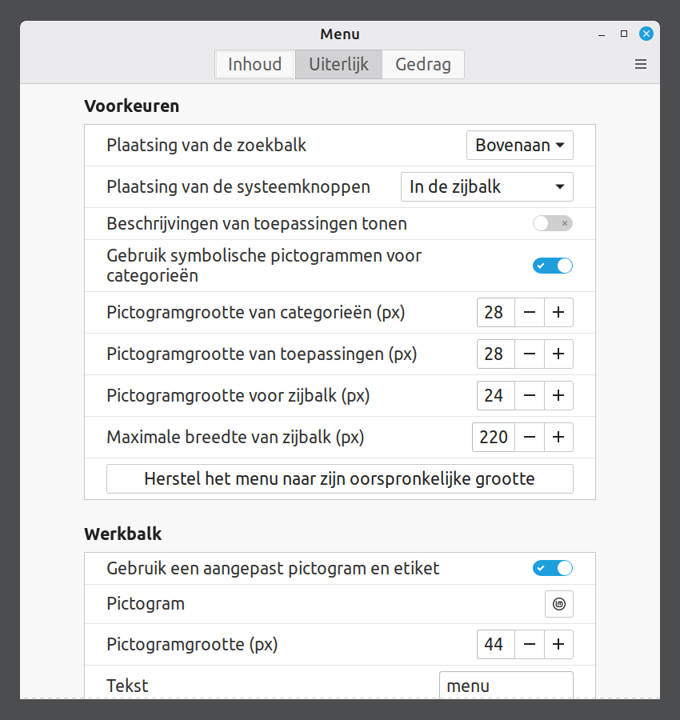
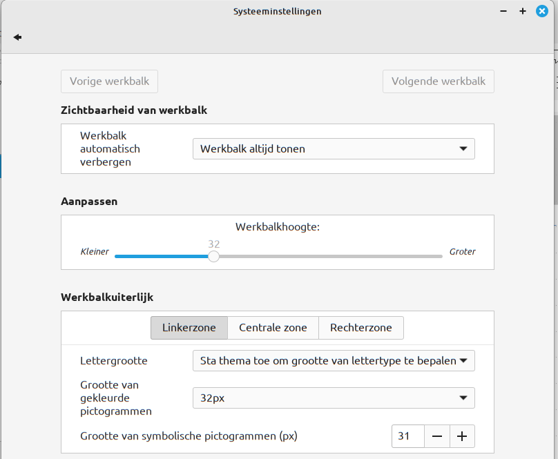
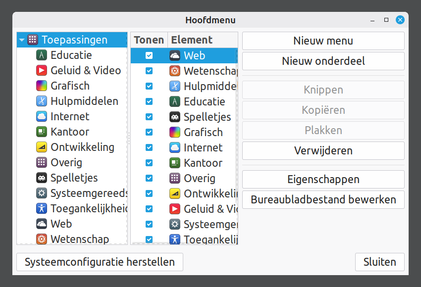

# Van Start Met Linux

Handleiding voor beginnende gebruikers

> WEGGOOIEN? MOOI NIET! REPAIRCAFE.ORG

Bron: https://github.com/Linux-Repair-Cafe/handbook/tree/main/html

[![CC BY-NC-SA 4.0][cc-by-nc-sa-image]][cc-by-nc-sa]

[cc-by-nc-sa]: http://creativecommons.org/licenses/by-nc-sa/4.0/
[cc-by-nc-sa-image]: https://licensebuttons.net/l/by-nc-sa/4.0/88x31.png

## Inleiding

Gefeliciteerd met je nieuwe Linux besturingssysteem! Je laptop gaat nu langer mee, je bent minder afhankelijk van commerciële bedrijven en je privacy wordt beter gewaarborgd.

Dit document helpt je je weg te vinden in Linux Mint. Het helpt je bij het afronden van de installatie, het instellen van het uiterlijk en het beantwoorden van de eerste vragen die je misschien hebt. Ongeveer de helft van de inhoud gaat over zaken die je maar één keer hoeft in te stellen. We hopen dat je zo een vlot begin kunt maken met het gebruik van je ‘nieuwe’ Linux-computer.

De opmaak in dit document is als volgt:

- Namen van programma’s zien er zo uit: <ins>Energiebeheer</ins>.

👉 Een wijzend handje voor tekst geeft aan dat je handelingen op de computer gaat uitvoeren.

Misschien heb je nog niet eerder met Linux gewerkt. Geen nood, je staat er niet alleen voor. Online is ongelooflijk veel informatie te vinden over dit besturingssysteem. Heb je een vraag, dan is de kans groot dat iemand anders die al eens heeft gesteld – en antwoord heeft gekregen. Post je een vraag op een forum, dan helpt iemand je meestal binnen een dag verder.

Hieronder vind je een aantal betrouwbare, veelgebruikte websites en fora:

Nederlandstalige bronnen:

- [Linux Mint Nederland](https://www.linuxmintnl.nl/)
- [Linux Mint Forum NL](https://forums.linuxmint.com/viewforum.php?f=67)
- [LibreOffice Nederland](https://nl.libreoffice.org/)
- [LibreOffice Vragenforum NL](https://ask.libreoffice.org/c/dutch/18)

Engelstalige bronnen (gebruik de vertaalfunctie van <ins>Firefox</ins> als je Engels lastig vindt).

- [Official Website](https://linuxmint.com/)
- [Linux Mint Forum](https://forums.linuxmint.com/)
- [Tutorials / Gidsen](https://linuxmint-installation-guide.readthedocs.io/en/latest/)
- [Reddit](https://www.reddit.com/r/linuxmint/)
- [Linux Mint Forum](https://forums.linuxmint.com/)
- [Ubuntu Vraag & Antwoord](https://askubuntu.com/) – Linux Mint is gebaseerd op Ubuntu. Veel Ubuntu-oplossingen zijn
ook bruikbaar in Linux
- [LibreOffice Forum](https://ask.libreoffice.org/c/english/5)

Videomateriaal:

- [YouTube](https://www.youtube.com/) – zoek op specifieke onderwerpen, bijvoorbeeld ‘Linux Mint instellen’

Een zoektip voor internet: begin je zoekopdracht met: ‘Linux Mint + [vul hier het onderwerp in]’. Bijvoorbeeld: ‘Linux Mint + wachtwoord veranderen’. Zo vermijd je zoekresultaten voor andere besturingssystemen.

## De eerste keer opstarten

Linux Mint is geïnstalleerd op je computer alsof deze nieuw uit de winkel komt. Na de eerste keer opstarten zijn nog een paar stappen nodig om je nieuwe systeem gebruiksklaar te maken. Die zijn misschien al voor je gedaan in het Linux Repair Cafe en anders ga je ze nu zetten. Ook is het verstandig om enkele noodzakelijke aanvullingen direct te installeren, zoals updates.

In dit hoofdstuk lopen we alle onderdelen stap voor stap met je door. Veel van deze handelingen zijn maar één keer nodig. Na deze stappen is je systeem klaar voor gebruik.

Volg de stappen rustig en in je eigen tempo — je bent bijna klaar om met Linux aan de slag te gaan!

### Afronden van de installatie

Wanneer je de computer voor het eerst opstart, doorloop je een aantal stappen om je systeem gebruiksklaar te maken:

- Taalinstelling. Kies de taal waarin je wilt dat het systeem met je communiceert. Kies de taal die voor jou het meest vertrouwd is. Je kunt deze keuze later altijd aanpassen.
- Toetsenbordindeling. Je kunt bijvoorbeeld kiezen voor Engels (VS, internationaal, met dode toetsen). Daarmee kun je accenten typen zoals ö, ë, è en ï. Of kies Engels (VS, euroteken op 5). De euro (€) krijg je dan door de rechter ALT toets en 5 te kiezen. Wil je later een extra toetsenbordindeling toevoegen? Dat kan altijd als je de installatie hebt afgerond.
- Wifinetwerk. Als je computer niet met een netwerkkabel is verbonden, zal hij om het wifiwachtwoord vragen. Voer het wachtwoord van je router in.
- Locatie. Bevestig de standaardlocatie (meestal Amsterdam) of kies handmatig een ander land of andere regio.
- Gebruikersnaam (accountnaam). Deze naam wordt ook gebruikt voor je persoonlijke map (bijv. / home/jouwnaam). 

    Kies een korte, duidelijke gebruikersnaam die bestaat uit:
	- Alleen kleine letters
	- Geen spaties of leestekens
	- Eén woord dat voor jou herkenbaar is

- Wachtwoord. Omdat je ook beheerder bent van je systeem, kies je een sterk wachtwoord
van minimaal twaalf tekens en met voldoende variatie (cijfers, hoofdletters, symbolen). Kies een wachtwoord dat je ook kunt onthouden of gebruik een zin in plaats van letters, nummers en tekens. Deel dit met iemand die je vertrouwt of schrijf het op.
>  bos schildpadden lezen boeken bij zonsopkomst
- Automatisch aanmelden. Als je dit selecteert, hoef je bij het opstarten niet je wachtwoord te geven. Dit raden we af, omdat je computer dan voor anderen direct toegankelijk is.
- Versleuteling van je persoonlijke map. We raden aan om deze optie in te schakelen. Je gegevens worden dan versleuteld opgeslagen, dat biedt extra bescherming bij verlies of diefstal van je computer. Deze maatregel is in sommige situaties (zoals administratief werk voor verenigingen) zelfs verplicht vanwege de privacywetgeving. Voor de versleuteling heb je geen extra wachtwoord nodig.

> [!CAUTION]
> Bij versleuteling zijn je gegevens écht versleuteld. Als je het wachtwoord kwijtraakt, kun je bestanden niet meer herstellen. Er is geen magische truc om ze terug te halen. Vandaar de tip om een wachtwoord te kiezen dat je kunt onthouden, en om dat op te schrijven of te delen met iemand die je vertrouwt.

### Updates installeren

De versie van Linux Mint die op je computer is geïnstalleerd, is een momentopname. Kritische beveiligings updates en software correcties komen regelmatig (dagelijks/wekelijks) beschikbaar. Het is verstandig deze updates meteen te installeren voordat je verder gaat met het verkennen van je computer.

👉 Klik op het veiligheidsschild met de rode stip in de werkbalk onderaan.

Het scherm <ins>Bijwerkbeheer</ins> opent.

👉 Klik op ‘OK’.

Je ziet weer het scherm van <ins>Bijwerkbeheer</ins>.

👉 Klik aan de bovenkant op ‘Verversen’.

Er kan een mededeling komen dat een nieuwe versie van <ins>Bijwerkbeheer</ins> beschikbaar is. In dat geval:

👉 Klik op ‘Actualisering uitvoeren’.

👉 Geef je wachtwoord.

De update van <ins>Bijwerkbeheer</ins> zelf wordt nu geïnstalleerd. Zodra deze klaar is:

👉 Klik bovenaan op ‘Actualiseringen installeren’.

De updates worden gedownload en geïnstalleerd. Dit kan de eerste keer tot een half uur duren, afhankelijk van je internetverbinding. Wacht dit rustig af.

👉 Sluit het scherm <ins>Bijwerkbeheer</ins>.

Vanaf nu worden updates automatisch uitgevoerd. Dit is zichtbaar in de onderste taakbalk aan het tandwiel-icoon.

Je kunt altijd handmatig een update forceren door op het veiligheidsschild te klikken. Sommige updates worden trouwens pas actief na een herstart van je computer. Hier krijg je een melding van.

## Programma’s gebruiken

Nu je de installatie hebt afgerond en de laatste updates hebt geïnstalleerd, is je computer klaar voor gebruik. De volgende hoofdstukken helpen je bij het wennen aan Linux. Dit hoofdstuk gaat over het gebruik van programma’s.

### Programma’s openen

Programma’s kun je eenvoudig openen via het menu van Linux Mint. Dit doe je zo:

👉 Klik op het Linux Mint-icoon linksonder in beeld of op de Windows-toets op je toetsenbord.

👉 Klik op het programma dat je wilt gebruiken. 

Bijvoorbeeld: Menu > Voorkeuren > Geluid

### Het formaat aanpassen

Je kunt het menu groter of kleiner maken door aan de randen te slepen.

### Zoeken naar een programma

Onderaan in het menu staat een zoekveld.

👉 Typ een algemene term, zoals: ‘tekst’, ‘mail’, ‘internet’, ‘video’, ‘afdruk’, ‘muis’, ‘player’, ‘reken’, enzovoort.

Het menu toont alle programma’s die te maken hebben met het onderwerp dat je hebt ingetypt. Weet je de naam van het programma al? Typ die dan direct in.

### Programma’s starten

👉 Klik op de naam van het programma om het te starten.

### Snelkoppeling op het bureaublad maken

👉 Rechterklik op het programma in het menu.

👉 Kies ‘Toevoegen aan het bureaublad’ om de snelkoppeling te maken.

### Bladeren door categorieën

👉 Klik op een categorie in de middelste kolom van het menu.

De rechterkolom toont alle bijbehorende programma’s.

👉 Klik op een programma om het te starten.

## E-Mail Instellen

Om email te lezen kun je de website van je email provider bezoeken. Als alternatief kun je een lokaal email programma gebruiken zoals <ins>Thunderbird</ins>.
Voor het instellen van <ins>Thunderbird</ins> heb je je gebruikersnaam (meestal het email adres) en je wachtwoord van je mailaccount nodig.

👉 Start <ins>Thunderbird</ins> via het menu.

👉 Beantwoord de vragen die verschijnen.

<ins>Thunderbird</ins> haalt op de achtergrond automatisch ook een aantal e-mailinstellingen op.

Als alles goed is ingevuld, heb je snel toegang tot je mailbox.

Kom je er niet uit? Raadpleeg de handleiding over automatische accountconfiguratie via de [website van Mozilla](https://support.mozilla.org/nl/kb/automatische-accountconfiguratie).

> Gebruik de import/export functie van <ins>Thunderbird</ins> als je je emails van <ins>Thunderbird</ins> op een andere computer wilt overzetten.

## Bestanden Beheren

In Linux Mint gebruik je het programma Bestanden (ook wel <ins>Nemo</ins> genoemd) om mappen en
bestanden te openen, te zoeken en beheren.

### Bestanden openen en zoeken

Openen:

Start <ins>Bestanden</ins>

👉 Klik op het tweede pictogram van links in de taakbalk onder aan het scherm.

Zoeken:

👉 Klik op het vergrootglas rechtsboven om het zoekvenster te openen.

👉 Typ (een deel van) de bestandsnaam.

Zoeken is niet hoofdlettergevoelig – het pictogram Aa geeft dat aan. Standaard zoekt het
programma ook in submappen. Het L-vormige pijltje naar rechts geeft dit aan.

### Bestanden verwijderen

Verwijder je een bestand via het rechtsklikmenu of de Delete-toets? Dan gaat het eerst naar de prullenbak. Verwijder je het ook uit de prullenbak, dan is het bestand permanent verwijderd.

### Meer weten over het programma <ins>Bestanden</ins>?

Bekijk de uitgebreide uitleg op: https://community.linuxmint.com/software/view/nemo

## Programma’S Installeren En Verwijderen

Met een paar eenvoudige stappen kun je in Linux Mint nieuwe programma’s installeren of bestaande software verwijderen. Dit doe je via <ins>Programmabeheer</ins>. We leggen stap voor stap uit hoe je dat doet.

### Een programma installeren

👉 Druk op de Windows-toets of klik links onder op het menu.

👉 Typ ‘prog’ in het zoekveld of vind <ins>Programmabeheer</ins> via menu > Beheer > <ins>Programmabeheer</ins>

👉 Klik op <ins>Programmabeheer</ins> in de lijst met resultaten.

Het programma opent met de melding: ‘Aan het laden, een ogenblik geduld.’ Wacht even tot de inhoud volledig is geladen en je programma’s te zien krijgt.

👉 Typ in het zoekveld van <ins>Programmabeheer</ins> ‘screen’.

Je krijgt nu een overzicht van alle programma’s die iets met screen te maken hebben. Zoek in de lijst naar <ins>Simple Screen Recorder</ins>. Dit programma maakt een video-opname van je bureaublad terwijl je werkt.

👉 Klik op de naam om het programma te openen.

👉 Klik op de knop ‘Installeren’ om het programma te installeren.

Je wordt mogelijk gevraagd om het wachtwoord in te voeren.

Na de installatie is het programma beschikbaar via het menu.

Zodra je in <ins>Programmabeheer</ins> op een programma klikt, opent er een overzichtsscherm met meer informatie. Rechtsboven zie je de knop ‘Installeren’ (of ‘Verwijderen’ als het programma al is geïnstalleerd).

### Een programma verwijderen

👉 Open <ins>Programmabeheer</ins> .

Zoek het programma op zoals je dat ook deed bij het installeren.

In plaats van de kop ‘Installeren’ zie je nu de knop ‘Verwijderen’.

👉 Klik op ‘Verwijderen’. Het programma wordt verwijderd uit je systeem.

## Veelvoorkomende Toepassingen

Je computer is nu klaar voor gebruik. Tijd om ermee aan de slag te gaan voor alledaagse taken. Met onze heldere uitleg en handige tips helpen we je het maximale uit je Linux-systeem te halen.

### Internetaccounts

Online accounts zoals Google (Drive), Microsoft (OneDrive) , NextCloud, etc. kunnen toegevoegd worden met het <ins>Internetaccounts</ins> programma. De accounts komen beschikbaar als netwerk schijven onder <ins>Nemo</ins>/Bestanden

### Teams- of Zoombijeenkomsten bijwonen

We raden aan bijeenkomsten te volgen via de webbrowser Firefox. Overweeg om van veel gebruikte web toepassingen een programma te maken met <ins>Webtoepassingen</ins>

### Een e-boek lezen

Er zijn diverse readers te installeren, bijvoorbeeld <ins>FBReader</ins>. E-boeken van de bibliotheek kun je alleen lezen via de browser, een app op telefoon of tablet.

### Een dvd afspelen

Gebruik <ins>VLC Media Player</ins> als je een DVD wilt afspelen. Installeer <ins>VLC Media Player</ins> volgens de stappen in het hoofdstuk ‘Programma’s installeren en verwijderen’.

### De touchpad gebruiken

Om te scrollen, schuif met twee vingers tegelijk over het touchpad. Om met de zijkant van de touchpad te scrollen ga je eerst naar <ins>Muis en Touchpad</ins> instellingen.

### Meerdere schermen: video kijken op een tv of beamer

Sluit je computer aan op de tv met een HDMI-kabel. Stel de source van de tv in op de juiste HDMI-ingang. Linux vindt dan het tv-scherm en kopieert het naar je laptopscherm.

Het geluid van de laptop zal ook automatisch naar de HDMI-uitgang gaan. Is dat niet de bedoeling, dan kun je het naar de speakers van de computer sturen. Dit doe je als volgt:

👉 Druk op de Windows-toets.

👉 Zoek het programma <ins>Geluid</ins> en start dit door erop te klikken.

👉 Ga naar het tabblad ‘Uitvoer’.

👉 Klik op ‘Built in speakers’.

Is het de bedoeling dat het tv-scherm een uitbreiding is van het laptopscherm, dan doe je dit:

👉 Druk op de Windows-toets.

👉 Zoek naar het programma <ins>Beeldscherm</ins>.

👉 Klik hierop.

👉 Klik op ‘Schermen samenvoegen’.

👉 Klik en sleep scherm twee op de gewenste plek ten opzichte van het laptopscherm.

👉 Klik op ‘Toepassen’.

👉 Sluit <ins>Beeldscherm</ins>.

### Een printer aansluiten

Een printer kun je aansluiten met een kabel of via wifi. Een kabel steek je direct in de computer; via wifi zorg je dat de computer en de printer met hetzelfde netwerk verbonden zijn. De meeste printers worden automatisch herkend zodra je ze verbindt met het netwerk. Via het menu ‘Printers’ kun je eenvoudig een nieuwe printer toevoegen.

Vaak kiest Mint zelf het juiste stuurprogramma. Voor merken als HP, Canon of Epson zijn soms extra drivers nodig. Die kun je installeren via <ins>Softwarebeheer</ins> of de website van de fabrikant. Zodra de printer is toegevoegd, kun je direct afdrukken.

## Instellingen aanpassen

In Linux Mint kun je heel veel naar eigen smaak instellen: van lettertypes en pictogramgrootte tot achtergronden, kleuren en de werkbalk. Deze aanpassingen zijn niet alleen om je werkomgeving er leuker uit te laten zien. Ze maken hem ook gebruiksvriendelijker: als je slechter ziet, kun je bijvoorbeeld het standaardlettertype vergroten. Volg de stappen en pas je systeem aan naar je eigen smaak en gemak.

### Weergave en lettertypes

### Lettergrootte van vensters

Ga via <ins>Systeeminstellingen</ins> naar het onderdeel <ins>Lettertypen</ins> om de weergave van tekst in vensters aan te passen. Door het standaardlettertype te vergroten, verbetert de leesbaarheid voor slechtzienden aanzienlijk. Let op: het aanpassen van het documentlettertype heeft meestal weinig effect: veel programma’s gebruiken hun eigen instellingen voor lettertype en -grootte.

### Bureaubladachtergrond

Vanuit <ins>Systeeminstellingen</ins> start je <ins>Achtergronden</ins>. Probeer gewoon wat dingen uit. Om een effen kleur in te stellen:

👉 Klik op de tab ‘Instellingen’.

👉 Bij Fotoverhouding kies je ‘Geen afbeelding’.

👉 Gebruik het kleuricoon om een kleur te kiezen.

👉 Kies ‘Effen kleur’ of ‘Kleurverloop horizontaal/verticaal’ voor extra effect.

### Pictogrammen vergroten van het Linux Mint-menu

👉 Rechtsklik op het pictogram van Linux Mint.

👉 Selecteer ‘Instellen’.

👉 Pas de pictogram grootte aan naar smaak

👉 Sluit het menu programma

👉 Klik op – of + om de grootte van het Linux Mint-pictogram te vergroten of te verkleinen.

### Bureaublad en taakbalk

### Pictogrammen op het bureaublad instellen

Wil je pictogrammen op je bureaublad plaatsen, zoals de prullenbak of de computer? Deze werken als sneltoetsen.

Ga naar <ins>Systeeminstellingen</ins>, start <ins>Bureaublad</ins> en vink aan wat gewenst is.

Als je klikt op het pictogram ‘Computer’, opent het een venster waarin je de verschillende schijven, aangesloten apparaten en soms netwerkbronnen ziet. Dit is vergelijkbaar met ‘Deze PC’ of ‘Mijn computer’ in Windows.

### Werkbalk onder aan het bureaublad aanpassen

Vanuit <ins>Systeeminstellingen</ins> start je <ins>Werkbalk</ins>.

De werkbalk kleurt roze om aan te geven dat je in bewerkingsmodus zit. De aanpassingen worden direct zichtbaar.

👉 Schuif de ‘Werkbalkhoogte’ naar een prettige hoogte.

👉 Sluit het werkbalk configuratie programma.

De taakbalk krijgt weer zijn normale kleur, je bent terug in de normale werksituatie.

### Onderdelen van het Linux Mint-menu

Hier kun je de zichtbaarheid van programma’s aan- en uitzetten, ze verschijnen dan wel of niet in het menu. Als je alleen de programma’s instelt die je gebruikt, wordt het menu overzichtelijker. Let op: de pictogrammen komen ook niet meer voor in de zoekresultaten als je iets in het zoekvenster intikt.

👉 Rechtermuisklik op het Linux Mint-pictogram.

👉 Kies ‘Menu bewerken’. Je ziet nu dit scherm.

<!-- TODO: localise screenshot -->

Je kunt de programma’s altijd weer zichtbaar maken. Dit doe je door het <ins>Hoofdmenu</ins> te openen en onder de categorie waar je je programma verwacht het vinkje van het programma weer aan te vinken. Klik hierna op ‘Sluiten’.

### Systeeminstellingen

De meeste instellingen van je systeem kun je eenvoudig vinden via het Linux Hoofdmenu:

👉 Open het Linux Hoofdmenu.

👉 Typ ‘Systeem’ in het zoekvenster.

👉 Klik op <ins>Systeeminstellingen</ins>.

In dit menu kun je op verschillende pictogrammen klikken om instellingen aan te passen voor scherm, geluid en netwerk.

### Energiebeheer

Met het programma <ins>Energiebeheer</ins> kun je drie dingen regelen.

- Wat je laptop doet als je hem dichtklapt: in pauzestand gaan of afsluiten.
- Hoe de aan/uitknop zich gedraagt. Er zijn de volgende opties: de knop doet niets, het scherm wordt uitgeschakeld, de laptop gaat in slaap of het systeem wordt afgesloten.
- Het energiebeheer voor batterij en netvoeding. Je kunt onder andere de overgang tussen batterij en netvoeding instellen en wanneer de laptop in een energiebesparende modus gaat.
